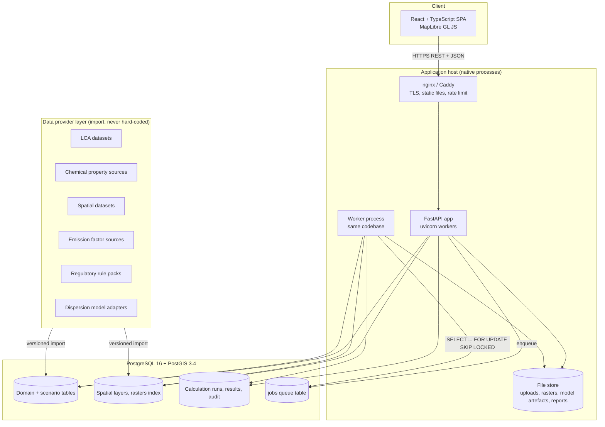
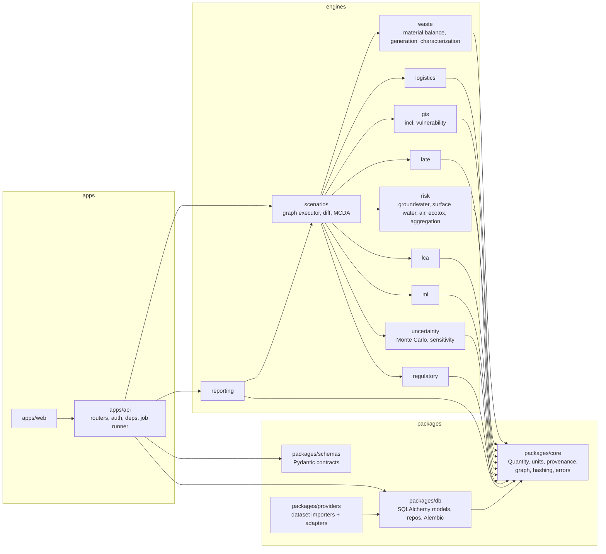
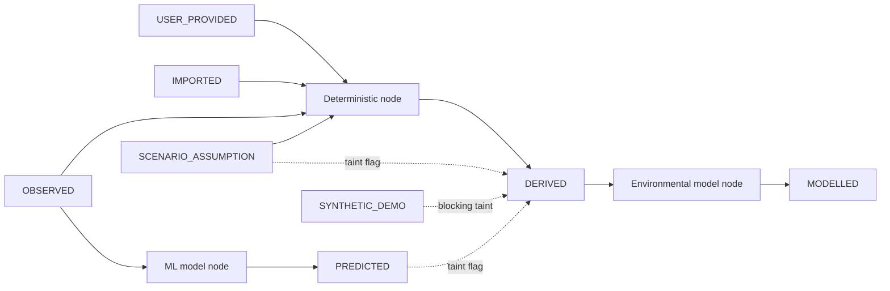

# Architecture

## 1. Design goals

1. Move environmental assessment upstream: a change to a material, chemical, process parameter or logistics decision propagates through to receptors and risk.
2. Scientific transparency: observed data, deterministic calculations, environmental models, GIS-derived variables, ML predictions, scenario assumptions, risk calculations, uncertainty and regulatory rules are separate layers with separate storage and separate labels.
3. Traceability: any number on screen or in a report can be walked back to its inputs, method version, dataset version, assumptions and the user who triggered it.
4. A modular monolith. One deployable API process plus one worker process, both running the same codebase. Engine packages have clean boundaries so a heavy engine can be extracted later without a rewrite.
5. Native operation. No containers at any layer.

## 2. Layer separation (the scientific principle, made structural)

| Layer | Meaning | Where it lives | Provenance class |
|-------|---------|----------------|------------------|
| A | Observed or user-provided data | Domain tables (`production_records`, `waste_streams`, ...) | `OBSERVED`, `USER_PROVIDED`, `IMPORTED` |
| B | Deterministic calculations | `engines/waste`, `engines/logistics`, `engines/lca` | `DERIVED` |
| C | Environmental models | `engines/fate`, `engines/risk` | `MODELLED` |
| D | GIS-derived variables | `engines/gis`, table `derived_spatial_variables` | `DERIVED` |
| E | ML predictions | `engines/ml`, table `ml_predictions` | `PREDICTED` |
| F | Scenario assumptions | `scenario_inputs` | `SCENARIO_ASSUMPTION` |
| G | Risk calculations | `engines/risk`, `risk_assessments` | `MODELLED` |
| H | Uncertainty | `engines/uncertainty`, `uncertainty_results` | carried on every `Quantity` |
| I | Regulatory rules | `engines/regulatory`, `regulatory_rules` | `IMPORTED` (rule), `DERIVED` (evaluation) |

No table mixes layers. A predicted waste quantity is never written into `production_records` or `waste_streams`; it is written to `ml_predictions` and referenced from a calculation node.

## 3. High-level architecture



Communication:

- Browser to API: REST over HTTPS, JSON, OpenAPI 3.1 generated by FastAPI. TypeScript client types are generated from the OpenAPI document (`openapi-typescript`), so frontend and backend cannot drift silently.
- API to engines: in-process Python function calls through the calculation graph executor. No HTTP between internal modules.
- API to worker: a `jobs` table in PostgreSQL. The worker claims rows with `FOR UPDATE SKIP LOCKED` and is woken by `LISTEN/NOTIFY`. This gives durable background processing with zero extra infrastructure. If load later justifies it, the `JobQueue` interface can be backed by natively installed Redis + RQ without changing callers.
- Job progress to browser: polling `GET /jobs/{id}` first; Server-Sent Events as an optional upgrade.
- Providers to database: explicit import commands that create a `dataset_version`; runtime code never calls an external service to fetch a scientific value mid-calculation.

## 4. Component architecture



Dependency rules, enforced by `import-linter` in CI:

1. `core` depends on nothing internal.
2. Engines depend on `core` and `schemas` only. Engines do not import each other, `db`, or `apps`. An engine that needs another engine's output receives it as an input from the graph.
3. Only `scenarios` composes engines. Only `apps/api` (routers, services and job handlers) talks to `db`, through repositories. The graph executor in `scenarios` reaches stored runs through a `RunStore` protocol that `scenarios` defines and `apps/api` implements over the repositories, so every engine, including `scenarios`, stays free of database imports.
4. `reporting` reads stored results, handed to it by `apps/api` through a read protocol in the same way; it never recomputes.

(Rule 3 was clarified during Phase 1: the earlier wording let `scenarios` import `db`, which contradicted rule 2 and `CLAUDE.md`. The protocol keeps the dependency direction one-way and lets `import-linter` enforce it.)

### Engine contract

Every engine exposes one or more node functions:

```python
@node(
    id="groundwater.screening",
    version="1.0.0",
    method_ref="docs/risk-engine.md#groundwater",
    layer=Layer.MODELLED,
)
def groundwater_screening(inp: GroundwaterInput, params: MethodParams) -> NodeResult[GroundwaterOutput]: ...
```

- `inp` and the output are frozen Pydantic models whose numeric fields are `Quantity`.
- The function is pure: same inputs give the same outputs. Randomness takes an explicit seed.
- `NodeResult` carries `status` (`ok`, `insufficient_data`, `out_of_validity_range`, `not_applicable`), `warnings`, `assumptions_used` and `limitations`.
- Missing data never raises a guess. It returns `insufficient_data` with a machine-readable list of the missing fields, which the UI turns into a data-gap checklist.

### The Quantity type

```python
class Quantity(BaseModel, frozen=True):
    value: float | None
    unit: str                        # pint-parsable, canonical SI-based units stored
    distribution: Distribution | None  # point, uniform, triangular, normal, lognormal, empirical, interval
    provenance: ProvenanceClass
    source_id: UUID | None           # dataset_version, record, model version, or assumption
    quality: DataQuality | None      # pedigree-style indicators where available
```

Arithmetic on `Quantity` uses `pint` for dimensional checking. Mixing units that are not dimensionally compatible is an error at the engine boundary, not a silent conversion. Combining quantities follows the combination rule in section 10: the output class comes from the node's layer, and the inputs' classes and taints are carried forward as taint flags. Arithmetic on quantities that carry a non-point distribution is refused; uncertainty is propagated only by `engines/uncertainty`, so no distribution is silently collapsed to a point.

Implemented in `packages/core` (`weta_core.quantity`, `weta_core.units`, `weta_core.provenance`). Two details fixed in Phase 1:

- `Quantity` also carries `taint` (a set of the four taint flags in section 10), so the flags travel with the value between nodes rather than being recomputed from lineage.
- `quality` is scheme-neutral (`scheme`, `scheme_version`, `scores`) until decision D-09 selects a data-quality scheme; no pedigree indicators are hard-coded.

## 5. Backend architecture

```
apps/api/weta_api/
  main.py              app factory, middleware, router mounting
  config.py            pydantic-settings, env-file driven
  deps.py              db session, current user, org scope, permission checks
  middleware/          request id, audit context, rate limit, security headers
  routers/             one module per resource group (see docs/api.md)
  services/            thin orchestration: validate, authorize, call repo or enqueue job
  jobs/                queue interface, worker loop, job handlers
  auth/                password hashing, tokens, sessions, MFA
```

Request flow: router (validation by Pydantic) -> dependency (authn, org scope, permission) -> service -> repository (SQLAlchemy 2, async with `asyncpg`) or job enqueue -> response model. Routers contain no business logic. Engines are CPU-bound and synchronous; they run in the worker process (or a process pool for short interactive recalculations), never on the event loop.

Job types: `scenario.run`, `uncertainty.monte_carlo`, `sensitivity.run`, `gis.derive`, `gis.import`, `dataset.import`, `ml.train`, `ml.batch_predict`, `report.build`. Each handler is idempotent and keyed by an input hash.

## 6. Calculation graph (shared spine of scenario, audit and provenance)

All results are produced by a directed acyclic graph of nodes. A node run is identified by

```
input_hash = sha256(node_id, node_version, canonical_json(inputs), method_params, dataset_version_ids, model_version_id, seed)
```

A `calculation_runs` row stores that hash, timings, status and the user and scenario that triggered it. `result_values` rows store the outputs. `calculation_run_inputs` rows record which upstream runs, records, dataset versions and assumptions fed it. This single mechanism provides:

- incremental recalculation (unchanged hash means reuse);
- audit trail (walk `calculation_run_inputs` backwards);
- provenance (each edge names the source and its class);
- reproducibility (rerun with the same hash inputs and compare).

Details in `docs/scenario-engine.md`.

## 7. Database, GIS, ML, LCA, risk, logistics, scenario and reporting architecture

Each has its own document. Summary of responsibilities and communication:

| Subsystem | Owns | Consumes | Doc |
|-----------|------|----------|-----|
| Database | Schema, migrations, RLS policies, repositories | n/a | data-model.md |
| Waste | Material balance, generation, characterization | Production, materials, chemicals | environmental-models.md |
| Logistics | Chain legs, tonne-km, trips, transport exposure and incident frequency | Waste outputs, routes, GIS corridor variables | logistics.md |
| GIS | Layers, derived spatial variables, vulnerability indices | Imported datasets, facility and route geometries | gis.md |
| Fate | Screening partitioning between compartments | Chemical properties, release estimates | environmental-models.md |
| Risk | Groundwater, surface water, atmospheric, ecotoxicity, aggregation | Fate, GIS variables, logistics, waste characterization | risk-engine.md |
| LCA | Inventory build, LCIA | Material balance, logistics, treatment, LCI and CF datasets | lca.md |
| ML | Training, registry, inference, SHAP, monitoring | Historical records, engineered features | ml.md |
| Uncertainty | Propagation, Monte Carlo, sensitivity | Any node subgraph | risk-engine.md |
| Regulatory | Rule evaluation | Any result value, rule packs | regulatory-engine.md |
| Scenario | Overrides, graph execution, comparison, MCDA | All engines | scenario-engine.md |
| Reporting | Report snapshots, exports | Stored results only | reporting.md |

## 8. Authentication architecture

- Local accounts first: email + password, Argon2id hashing (`argon2-cffi`), optional TOTP second factor.
- Session model: short-lived access token (JWT, 10 minutes, signed with EdDSA or HS256 from a file-based secret) held in memory by the SPA, plus an opaque rotating refresh token stored hashed in `user_sessions` and delivered in an `HttpOnly; Secure; SameSite=Strict` cookie. Refresh-token reuse revokes the whole session family.
- Later: OIDC single sign-on behind the same `IdentityProvider` interface (enterprise customers), without changing authorization.
- Authorization: RBAC with organization and project scope. Details in `docs/security.md`.

```mermaid
sequenceDiagram
  participant B as Browser
  participant A as API
  participant D as PostgreSQL
  B->>A: POST /auth/login (email, password, totp?)
  A->>D: load user, verify Argon2id, check lockout
  A->>D: insert user_sessions (hashed refresh token)
  A-->>B: access token (body) + refresh cookie
  B->>A: GET /projects (Authorization: Bearer)
  A->>A: verify token, load permissions (cached per request)
  A->>D: SET LOCAL app.org_id, app.user_id; query (RLS applies)
  A-->>B: 200
  B->>A: POST /auth/refresh (cookie)
  A->>D: rotate refresh token, detect reuse
  A-->>B: new access token + new cookie
```

## 9. Audit architecture

Two complementary records:

1. `audit_logs`: who did what to which entity, when, from where. Append-only (no UPDATE or DELETE privilege for the application role; enforced by trigger and grants). Each row carries the previous row's hash for the same organization (`prev_hash`, `row_hash`), which makes tampering detectable. Written by an API middleware plus SQLAlchemy event hooks for data changes (before and after images as JSONB diff).
2. Calculation lineage: `calculation_runs`, `calculation_run_inputs`, `result_values`. This answers "where did this number come from", which a generic audit log cannot.

Regulator view: `GET /results/{id}/trace` returns the full upstream tree: result -> node + method version -> inputs -> (record | dataset version | model version | scenario assumption) -> import job -> user and timestamp. The same tree is rendered in the UI trace panel and printed in the report appendix.

## 10. Data provenance architecture

Provenance classes (PostgreSQL enum `provenance_class`):

| Class | Definition | Example |
|-------|------------|---------|
| `OBSERVED` | Measured at the facility or in the field, with a measurement record | Weighbridge ticket, lab analysis |
| `USER_PROVIDED` | Entered by a user without a measurement record | Estimated solvent use typed into a form |
| `IMPORTED` | Loaded from an external dataset with a `dataset_version` | Land cover raster, LCI process, SDS property |
| `DERIVED` | Deterministic calculation or GIS operation on other data | Distance to nearest river, tonne-km |
| `MODELLED` | Output of an environmental model with assumptions | Screening travel time to a well |
| `PREDICTED` | Output of a statistical or ML model | Forecast waste quantity |
| `SCENARIO_ASSUMPTION` | Value set by a user as a what-if | "Replace solvent A with solvent B" |
| `SYNTHETIC_DEMO` | Fabricated for demonstration and tests only | Everything in `data/sample/` |

Rules:

1. Every stored numeric fact has a provenance class and a source reference. Enforced by NOT NULL columns and by the `Quantity` type.
2. Combination rule: an output's class is set by the node's layer (`DERIVED`, `MODELLED` or `PREDICTED`). In addition the result records `taint` flags inherited from its inputs: `has_predicted_input`, `has_scenario_assumption`, `has_synthetic_input`, `has_user_provided_input`. A deterministic tonne-km built on a predicted tonnage is `DERIVED` with `has_predicted_input = true`.
3. `SYNTHETIC_DEMO` is contagious and blocking: any result with `has_synthetic_input` is watermarked in the UI and reports, and reports containing it cannot be issued with status `FINAL`.
4. The UI shows the class as a labelled badge next to every value (text plus shape plus colour, never colour alone). Reports print it in a column and in the data-sources appendix.



## 11. Security architecture

See `docs/security.md`. Key structural choices: PostgreSQL row-level security keyed on `organization_id` as a second line of defence behind application authorization; all file uploads go through a validation pipeline before any parser touches them; secrets come from environment files readable only by the service account.

## 12. Monorepo structure

```
weta/
  apps/
    web/                     React + TS + Vite
    api/                     FastAPI app + worker entrypoint
  engines/                   each a uv workspace member, importable as weta_<name>
    waste/  logistics/  gis/  fate/  risk/  lca/  ml/
    uncertainty/  regulatory/  scenarios/  reporting/
  packages/
    core/                    Quantity, units, provenance, node decorator, hashing
    schemas/                 shared Pydantic models; OpenAPI -> TS types generated into apps/web
    db/                      SQLAlchemy models, repositories, alembic/
    providers/               importers and adapters for external datasets and models
  data/
    sample/                  SYNTHETIC_DEMO fixtures only
    schemas/                 JSON Schemas for import file formats
    reference/               small open reference tables with licence files (no proprietary data)
  models/
    registry/                model cards (JSON) mirrored from the DB
    trained/                 artefacts (gitignored), addressed by sha256
  docs/
  tests/
    reference_cases/         independently verified calculation cases (YAML + source citation)
    integration/  e2e/
  scripts/                   setup, import, backup, deployment (PowerShell + bash)
  pyproject.toml             uv workspace root
  pnpm-workspace.yaml
```

Differences from the suggested structure, and why: `uncertainty`, `regulatory`, `fate` and `reporting` are engines in their own right (they have distinct inputs, tests and versions); `core`, `db` and `providers` are packages so engines can stay free of database and network code; the material-balance, generation and characterization engines share one package (`waste`) because they share one domain model, but remain three separately versioned nodes.

## 13. Technology decisions

| Concern | Choice | Reason |
|---------|--------|--------|
| API | FastAPI, Pydantic v2 | Typed contracts, OpenAPI for free |
| ORM | SQLAlchemy 2 + GeoAlchemy2, Alembic | Mature PostGIS support |
| Units | pint | Dimensional safety |
| Graph | networkx (analysis) + own executor | Small, inspectable |
| Jobs | PostgreSQL queue + native worker | No extra service; durable |
| Raster | Rasterio, rioxarray; COG files on disk | Avoids bloating the database |
| Routing | OSM network via pgRouting (native PostGIS extension) or an external router behind an adapter | Reproducible hazardous-goods routing |
| ML | scikit-learn, LightGBM, statsmodels | Tabular, small-to-medium data |
| Explainability | SHAP (TreeExplainer / LinearExplainer) | Exact for tree and linear models |
| Sensitivity | SALib | Morris and Sobol implementations |
| PDF | WeasyPrint (HTML + CSS to PDF) | Native, no browser needed; needs Pango installed |
| Excel | openpyxl | Native |
| Frontend state | TanStack Query + Zustand | Server cache vs UI state separated |
| Maps | MapLibre GL JS, vector tiles from PostGIS `ST_AsMVT` | Open source |
| Charts | Apache ECharts or Observable Plot | Uncertainty bands, tornado, parallel coordinates |
