# Data model

PostgreSQL 16 with PostGIS 3.4, `pgcrypto`, `pg_trgm`, `btree_gist`, and optionally `pgrouting`. Managed by Alembic migrations in `packages/db/alembic`.

## 1. Conventions

- Primary keys: `id uuid` (UUIDv7 generated in the application so keys sort by time).
- Every tenant-owned table has `organization_id uuid NOT NULL` and a row-level security policy `organization_id = current_setting('app.org_id')::uuid`.
- Standard columns: `created_at`, `created_by`, `updated_at`, `updated_by`. Soft delete (`deleted_at`) only on user-facing master data; results and logs are never deleted by the application.
- Quantities are stored as a column group, never as bare numbers:
  `<name>_value double precision`, `<name>_unit text` (canonical unit, validated against `units`), and where uncertain `<name>_uncertainty_id uuid` referencing `uncertainty_specs`. Rows that hold facts carry `provenance provenance_class NOT NULL` and `source_ref_id uuid` referencing `source_refs`.
- Geometry: stored in EPSG:4326 (`geometry(<type>, 4326)`) with GiST indexes. Metric operations use `geography` casts or a project-level projected CRS (`projects.working_srid`, typically the local UTM zone) chosen at project creation.
- Enums are PostgreSQL enums for closed scientific vocabularies (`provenance_class`, `node_layer`, `run_status`) and lookup tables for vocabularies that grow (`waste_codes`, `hazard_classes`, `impact_categories`).
- JSONB is used only for: model hyperparameters, SHAP value vectors, rule applicability expressions, audit before/after diffs, report layout options, and dataset-specific metadata. Never for core domain facts.
- Time-varying facts use validity ranges (`valid_from`, `valid_to`) with exclusion constraints where overlap is illegal.

## 2. Schema groups

### 2.1 Identity and access

| Table | Key columns | Notes |
|-------|-------------|-------|
| `organizations` | name, slug, default_jurisdiction_id | Tenant |
| `users` | email (citext, unique), password_hash, totp_secret_enc, status, last_login_at | Argon2id hash |
| `organization_memberships` | user_id, organization_id, role_id | A user may belong to several organizations |
| `roles` | organization_id (null = system role), name | System roles: owner, admin, analyst, reviewer, viewer, regulator_readonly |
| `permissions` | code (for example `scenario.run`), description | Seeded, not user-editable |
| `role_permissions` | role_id, permission_id | M:N |
| `project_memberships` | project_id, user_id, role_id | Project-level override |
| `user_sessions` | user_id, refresh_token_hash, family_id, expires_at, revoked_at, ip, user_agent | Refresh rotation |
| `api_keys` | organization_id, key_hash, scopes, expires_at | Machine access |

### 2.2 Projects and facilities

| Table | Key columns | Notes |
|-------|-------------|-------|
| `projects` | organization_id, name, description, jurisdiction_id, working_srid, status | Unit of work and reporting |
| `facilities` | organization_id, name, sector_code (NACE / ISIC), operator, status | Master data, shared across projects |
| `project_facilities` | project_id, facility_id | M:N |
| `facility_locations` | facility_id, geom Point, boundary Polygon null, address, valid_from, valid_to | History of location |
| `storage_units` | facility_id, name, storage_type, capacity (Q), containment_type_id, secondary_containment bool, geom Point | Used by spill screening |

(Q) marks a quantity column group.

### 2.3 Production

| Table | Key columns | Notes |
|-------|-------------|-------|
| `production_processes` | facility_id, name, description, product_id, functional_unit_value/unit | One process per product line |
| `process_steps` | process_id, sequence_no, name, step_type, operating_parameters | Ordered unit operations |
| `process_parameters` | process_step_id, parameter_code, value (Q), provenance | Temperature, yield, recovery rate, etc. Relational, not JSON |
| `products` | organization_id, name, unit | |
| `materials` | organization_id, name, material_type (raw, auxiliary, packaging, fuel, water), default_unit | |
| `chemicals` | cas_number (unique, validated checksum), ec_number, name, inchikey, molecular_weight | Global, not tenant-owned |
| `material_compositions` | material_id, chemical_id, mass_fraction (Q), provenance, source_ref_id | A material is a mixture of chemicals |
| `chemical_properties` | chemical_id, property_code, value (Q), temperature_k, method, provenance, source_ref_id, dataset_version_id | One row per property per source. Multiple sources may coexist; selection policy picks one and records it |
| `property_definitions` | code (for example `log_kow`, `koc`, `henry_constant`, `water_solubility`, `vapour_pressure`, `pnec_freshwater`, `half_life_soil`), dimension, description | Controlled vocabulary |
| `chemical_hazard_classifications` | chemical_id, scheme (GHS / CLP), hazard_class, category, h_statement, source_ref_id | Imported, never typed by guess |
| `step_inputs` | process_step_id, material_id, quantity_per_fu (Q), provenance | Bill of materials per functional unit |
| `step_outputs` | process_step_id, output_type (product, by-product, waste, emission, wastewater), ref_id, quantity_per_fu (Q) | Design values |
| `transfer_coefficients` | process_step_id, chemical_id or material_id, output_type, output_ref_id, fraction (Q), provenance, source_ref_id | Share of an input reporting to each output |
| `production_records` | process_id, period (daterange), output_quantity (Q), provenance, source_ref_id | Observed production |
| `material_consumption_records` | process_id, material_id, period, quantity (Q), provenance | Observed consumption |

### 2.4 Waste, emissions, wastewater

| Table | Key columns | Notes |
|-------|-------------|-------|
| `waste_codes` | scheme (EU LoW, Basel, US RCRA, national), code, description, is_hazardous | Imported lists, versioned |
| `hazard_classes` | scheme (HP codes, ADR class, GHS), code, description | |
| `waste_streams` | facility_id, process_step_id null, name, physical_state, waste_code_id, storage_unit_id | Definition of a stream |
| `waste_stream_hazards` | waste_stream_id, hazard_class_id, basis (measured, calculated, declared), source_ref_id | |
| `waste_generation_records` | waste_stream_id, period, quantity (Q), provenance, source_ref_id | Observed generation |
| `waste_compositions` | waste_stream_id, chemical_id, mass_fraction (Q), valid range, provenance, source_ref_id | Observed or declared composition |
| `emissions` | facility_id, process_step_id, emission_point_id, chemical_id, compartment (air, water, soil), period, quantity (Q), provenance | Observed releases |
| `emission_points` | facility_id, type (stack, vent, fugitive, outfall), geom, height (Q), diameter (Q), exit_velocity (Q), exit_temperature (Q) | Stack characteristics |
| `wastewater` | facility_id, process_step_id, outfall_id, period, volume (Q), receiving_feature_id | Stream-level |
| `wastewater_compositions` | wastewater_id, chemical_id or parameter_code (COD, BOD, TSS, pH), concentration (Q), provenance | |

### 2.5 Logistics and treatment

| Table | Key columns | Notes |
|-------|-------------|-------|
| `treatment_facilities` | organization_id null, name, geom, operator, permit_ref | External or internal |
| `treatment_technologies` | code (incineration, physico-chemical, biological, solvent recovery, ...), category (treatment, recovery, disposal), r_d_code | Controlled list |
| `treatment_facility_capabilities` | treatment_facility_id, technology_id, accepted_waste_code_id, capacity (Q) | |
| `disposal_facilities` | name, geom, type (landfill class, deep well, ...), liner_type, leachate_collection bool | |
| `transfer_stations` | name, geom | |
| `vehicles` | organization_id, vehicle_class_id, payload_capacity (Q), fuel_type, emission_standard | |
| `vehicle_classes` | code, description, emission_factor_key | Key into the transport emission-factor provider |
| `logistics_chains` | waste_stream_id, name, valid range | Baseline chain per stream |
| `logistics_legs` | chain_id, sequence_no, from_node_type/id, to_node_type/id, mode (road, rail, inland water, sea, pipeline), vehicle_class_id, route_id, frequency (Q), load_per_trip (Q) | |
| `transport_routes` | name, geom LineString, length_m, routing_profile, routing_engine_version, dataset_version_id (network), provenance | A route is derived from a network version |
| `route_segments` | route_id, seq, geom, road_class, length_m | For per-segment exposure |
| `transport_events` | leg_id, vehicle_id, departed_at, arrived_at, quantity (Q), consignment_ref, provenance | Observed movements |
| `treatment_assignments` | waste_stream_id, treatment_facility_id or disposal_facility_id, technology_id, share (Q), valid range | Where the waste ends up |

### 2.6 Spatial

| Table | Key columns | Notes |
|-------|-------------|-------|
| `datasets` | organization_id null (null = global), name, category, publisher, licence, citation, url | Any external or uploaded dataset |
| `dataset_versions` | dataset_id, version_label, retrieved_at, checksum_sha256, file_uri, spatial_extent, crs, resolution, import_job_id, status | Immutable once `active` |
| `environmental_layers` | dataset_version_id, layer_type_id, storage (vector_table, raster_cog), raster_uri, band_meta, attribute_schema | One logical layer |
| `layer_types` | code (rivers, aquifers, protected_areas, land_cover, soil, dem, population, ...), geometry_kind, required_attributes | Controlled list |
| `spatial_features` | layer_id, geom Geometry, feature_class, name, attributes jsonb, source_feature_id | Vector features. Partitioned by `layer_id`. JSONB here is justified: attribute schemas differ per source dataset |
| `environmental_receptors` | project_id, receptor_type_id, name, geom, spatial_feature_id null, sensitivity_class_id, provenance | Receptors curated for assessment (wells, schools, habitats) |
| `receptor_types` | code (drinking_water_well, surface_water_body, wetland, protected_area, school, hospital, settlement, ...), compartment | |
| `meteorological_series` | dataset_version_id, station_or_cell geom, variable_code, period, statistic, value (Q) | Wind roses, precipitation normals |
| `derived_spatial_variables` | subject_type (facility, storage_unit, route, route_segment, receptor), subject_id, variable_code, value (Q), method_code, method_version, parameters jsonb, calculation_run_id | GIS-derived layer D; always `DERIVED` |
| `spatial_variable_inputs` | derived_spatial_variable_id, dataset_version_id | Lineage to source layers |

Source data (`dataset_versions`, `environmental_layers`, `spatial_features`), derived variables (`derived_spatial_variables`) and model outputs (`result_values`) are three physically separate places.

### 2.7 Scenarios and calculation

| Table | Key columns | Notes |
|-------|-------------|-------|
| `scenarios` | project_id, name, kind (baseline, alternative, combined), parent_scenario_id, status, locked_at | Baseline has no parent |
| `scenario_components` | combined_scenario_id, component_scenario_id, order_no | Combined interventions |
| `scenario_inputs` | scenario_id, target_table, target_id, target_field, op (set, scale, add, replace_ref, remove, insert), value (Q) or ref_id, rationale text NOT NULL, provenance = SCENARIO_ASSUMPTION | One row per override. Deltas relative to parent |
| `calculation_runs` | scenario_id, node_id, node_version, input_hash (unique with node_id), status, started_at, finished_at, triggered_by, job_id, seed, warnings jsonb | One execution of one node |
| `calculation_run_inputs` | run_id, input_name, source_kind (run, record, dataset_version, model_version, scenario_input, assumption, regulatory_rule), source_table, source_id | Lineage edges |
| `result_values` | run_id, output_code, subject_type, subject_id, chemical_id null, value (Q), provenance, taint flags, status | The single home of computed numbers. This table is what `scenario_outputs` in the brief refers to |
| `scenario_outputs` | VIEW over `result_values` joined to the latest successful run per (scenario, node, subject) | Read model for the UI |
| `assumptions` | code, title, text, category, default_value (Q), source_ref_id, version | Assumption register (mirrors `docs/assumptions.md`) |
| `run_assumptions` | run_id, assumption_id, value_used (Q) | Which assumptions a run used |
| `method_versions` | node_id, version, doc_ref, validity_range jsonb, released_at, status | Registry of engine methods |
| `jobs` | type, payload jsonb, status, priority, attempts, locked_by, locked_at, progress, error | Queue |

### 2.8 Risk, LCA, uncertainty

| Table | Key columns | Notes |
|-------|-------------|-------|
| `risk_assessments` | scenario_id, pathway (groundwater, surface_water, air, ecotoxicity, transport), source_subject, receptor_id, chemical_id, run_id, tier (screening, refined), classification, limiting_factor | Header rows; numbers stay in `result_values` |
| `release_scenarios` | scenario_id, source_type/id, kind (routine, accidental), chemical_id, released_mass (Q), duration (Q), frequency (Q, nullable = not quantified), run_id | Input to pathway screening |
| `vulnerability_schemes` | organization_id null, theme, name, version, origin (published, organization_defined), definition (classes, ratings, weights), source_ref_id, rationale | Used by Engine 11 |
| `emission_factors` | dataset_version_id, technology_code or vehicle_class key, pollutant chemical_id, value (Q), basis, conditions | Imported only |
| `transport_incident_rates` | dataset_version_id, jurisdiction_id, road_class, vehicle_type, rate (Q per vehicle-km), release_probability (Q), reference_year | Imported only |
| `decision_analyses` | project_id, scenario_ids, objectives jsonb (indicator, direction, weight, constraint), method, normalization, performance_matrix_snapshot, result jsonb, created_by | Stores everything needed to reproduce a ranking |
| `risk_matrices` | organization_id null, name, version, definition (likelihood and consequence classes) | Configurable, versioned |
| `lca_assessments` | scenario_id, goal_scope_id, lcia_method_version_id, run_id, system_boundary, functional_unit (Q) | |
| `lca_goal_scopes` | project_id, goal, functional_unit, boundary, allocation_rule, cutoff_rule | ISO 14040/14044 goal and scope |
| `lci_processes` | dataset_version_id, external_id, name, geography, reference_flow_id, reference_amount (Q) | Imported unit or system processes |
| `lci_flows` | dataset_version_id, external_id, name, flow_type (elementary, product, waste), compartment, subcompartment, cas_number, unit | |
| `lci_exchanges` | process_id, flow_id, direction, amount (Q), uncertainty_id | |
| `lci_activity_links` | project scope: activity_kind (material, transport, energy, treatment), activity_ref_id, lci_process_id, conversion (Q), match_quality, chosen_by | The mapping from Weta activities to LCI processes; auditable |
| `lcia_methods` | name (for example EF 3.1, ReCiPe 2016), publisher | |
| `lcia_method_versions` | lcia_method_id, version, dataset_version_id | |
| `impact_categories` | lcia_method_version_id, code, name, indicator, unit | |
| `characterization_factors` | impact_category_id, flow_id, factor_value, factor_unit, region null | Imported only |
| `lci_results` | lca_assessment_id, flow_id, life_cycle_stage, amount (Q) | Inventory, separate from impact |
| `lcia_results` | lca_assessment_id, impact_category_id, life_cycle_stage, value (Q) | Impact assessment |
| `uncertainty_specs` | distribution (point, uniform, triangular, normal, lognormal, interval, empirical), p1..p4, sample_uri null, basis (measured, pedigree, expert, default), source_ref_id | Attached to any quantity |
| `uncertainty_results` | scenario_id, analysis_id, result_code, subject, n_samples, seed, mean, sd, p05, p25, p50, p75, p95, convergence_metric, samples_uri | Monte Carlo output summaries |
| `sensitivity_results` | analysis_id, method (oat, morris, sobol), output_code, input_code, index_name (mu_star, sigma, S1, ST, elasticity), value, ci_low, ci_high | |
| `uncertainty_analyses` | scenario_id, kind, config jsonb, run job_id, status | Header |

### 2.9 Machine learning

| Table | Key columns | Notes |
|-------|-------------|-------|
| `ml_models` | organization_id, task (waste_quantity, waste_composition, anomaly, forecast, ...), name, target_code, description | Logical model |
| `ml_training_datasets` | model_id, query_definition, row_count, time_range, feature_list, target, snapshot_uri, checksum | Frozen snapshot used for training |
| `ml_training_runs` | model_id, training_dataset_id, algorithm, hyperparameters jsonb, validation_method, cv_folds, random_seed, code_version (git sha), library_versions jsonb, started_at, finished_at | |
| `ml_model_versions` | model_id, training_run_id, version (semver), artefact_uri, artefact_sha256, status (candidate, staging, production, retired), applicability_domain jsonb, approved_by, approved_at | Registry |
| `ml_metrics` | training_run_id, split (train, cv, holdout), metric_code, value, ci_low, ci_high | Only measured values |
| `ml_predictions` | model_version_id, scenario_id null, subject, features_snapshot jsonb, predicted (Q with interval), in_domain bool, created_at | Always `PREDICTED` |
| `model_explanations` | prediction_id, method (shap_tree, shap_linear), base_value, contributions jsonb [{feature, value, shap}], explainer_version | Local explanations |
| `ml_feature_importances` | model_version_id, feature, mean_abs_shap, rank | Global |
| `ml_monitoring_snapshots` | model_version_id, period, drift_metrics jsonb, residual_stats jsonb, alert_level | |

### 2.10 Regulation, reporting, audit, provenance

| Table | Key columns | Notes |
|-------|-------------|-------|
| `jurisdictions` | code (EU, DE, GH, GB, US, ...), parent_id, name | Hierarchy: DE inherits EU |
| `regulations` | jurisdiction_id, title, citation, url, authority | |
| `regulatory_rules` | regulation_id, code, category, subject_code (which result or input it tests), comparator, threshold_value, threshold_unit, applicability jsonb, averaging_basis, effective_from, effective_to, version, source_ref_id, status | Data-driven |
| `rule_packs` | jurisdiction_id, name, version, checksum, imported_at | Signed bundle of rules |
| `regulatory_evaluations` | scenario_id, rule_id, run_id, subject, observed (Q), outcome (compliant, exceeds, not_applicable, insufficient_data), margin | |
| `reports` | project_id, template_id, title, status (draft, review, final), snapshot_id, created_by | |
| `report_snapshots` | report_id, scenario_ids, result_manifest jsonb (ids + hashes), frozen_at | Makes a report reproducible |
| `report_exports` | report_id, format (pdf, xlsx, csv, json), file_uri, sha256, generated_at | |
| `report_templates` | organization_id null, name, section_config jsonb, version | |
| `source_refs` | kind (dataset_version, document, measurement, user_entry, model_version, assumption), ref_id, citation, page_or_locator | Uniform pointer used by every fact row |
| `documents` | organization_id, filename, sha256, mime, file_uri, scan_status | SDS, lab reports, permits |
| `audit_logs` | organization_id, actor_id, action, entity_table, entity_id, diff jsonb, request_id, ip, occurred_at, prev_hash, row_hash | Append-only, hash-chained. Partitioned by month |

## 3. ERD

Core relationships (attributes omitted; see tables above).

```mermaid
erDiagram
  organizations ||--o{ organization_memberships : has
  users ||--o{ organization_memberships : joins
  roles ||--o{ organization_memberships : grants
  roles ||--o{ role_permissions : has
  permissions ||--o{ role_permissions : in
  organizations ||--o{ projects : owns
  organizations ||--o{ facilities : owns
  projects ||--o{ project_facilities : includes
  facilities ||--o{ project_facilities : in
  facilities ||--o{ facility_locations : located
  facilities ||--o{ storage_units : has
  facilities ||--o{ production_processes : runs
  production_processes ||--o{ process_steps : has
  process_steps ||--o{ process_parameters : has
  process_steps ||--o{ step_inputs : consumes
  process_steps ||--o{ transfer_coefficients : has
  materials ||--o{ step_inputs : used
  materials ||--o{ material_compositions : contains
  chemicals ||--o{ material_compositions : in
  chemicals ||--o{ chemical_properties : has
  chemicals ||--o{ chemical_hazard_classifications : classified
  production_processes ||--o{ production_records : observed
  process_steps ||--o{ waste_streams : generates
  waste_streams ||--o{ waste_generation_records : observed
  waste_streams ||--o{ waste_compositions : composed
  chemicals ||--o{ waste_compositions : in
  waste_codes ||--o{ waste_streams : classifies
  waste_streams ||--o{ waste_stream_hazards : has
  facilities ||--o{ emission_points : has
  emission_points ||--o{ emissions : releases
  facilities ||--o{ wastewater : discharges
  waste_streams ||--o{ logistics_chains : moved_by
  logistics_chains ||--o{ logistics_legs : has
  transport_routes ||--o{ logistics_legs : follows
  transport_routes ||--o{ route_segments : split
  logistics_legs ||--o{ transport_events : observed
  waste_streams ||--o{ treatment_assignments : sent_to
  treatment_facilities ||--o{ treatment_assignments : receives
  disposal_facilities ||--o{ treatment_assignments : receives
  datasets ||--o{ dataset_versions : versioned
  dataset_versions ||--o{ environmental_layers : provides
  environmental_layers ||--o{ spatial_features : contains
  projects ||--o{ environmental_receptors : defines
  spatial_features |o--o{ environmental_receptors : backs
  dataset_versions ||--o{ spatial_variable_inputs : used_by
  derived_spatial_variables ||--o{ spatial_variable_inputs : from
  projects ||--o{ scenarios : has
  scenarios |o--o{ scenarios : parent_of
  scenarios ||--o{ scenario_inputs : overrides
  scenarios ||--o{ calculation_runs : produces
  calculation_runs ||--o{ calculation_run_inputs : traced_by
  calculation_runs ||--o{ result_values : outputs
  calculation_runs ||--o{ run_assumptions : used
  assumptions ||--o{ run_assumptions : in
  scenarios ||--o{ risk_assessments : has
  environmental_receptors ||--o{ risk_assessments : exposed
  scenarios ||--o{ lca_assessments : has
  lcia_method_versions ||--o{ lca_assessments : uses
  lcia_method_versions ||--o{ impact_categories : defines
  impact_categories ||--o{ characterization_factors : has
  lci_flows ||--o{ characterization_factors : for
  lci_processes ||--o{ lci_exchanges : has
  lci_flows ||--o{ lci_exchanges : in
  lca_assessments ||--o{ lci_results : inventory
  lca_assessments ||--o{ lcia_results : impact
  scenarios ||--o{ uncertainty_analyses : has
  uncertainty_analyses ||--o{ uncertainty_results : yields
  uncertainty_analyses ||--o{ sensitivity_results : yields
  ml_models ||--o{ ml_training_runs : trained
  ml_training_datasets ||--o{ ml_training_runs : feeds
  ml_training_runs ||--|| ml_model_versions : creates
  ml_training_runs ||--o{ ml_metrics : measured
  ml_model_versions ||--o{ ml_predictions : makes
  ml_predictions ||--o| model_explanations : explained
  jurisdictions ||--o{ regulations : issues
  regulations ||--o{ regulatory_rules : contains
  regulatory_rules ||--o{ regulatory_evaluations : evaluated
  scenarios ||--o{ regulatory_evaluations : checked
  projects ||--o{ reports : has
  reports ||--|| report_snapshots : frozen_as
  reports ||--o{ report_exports : exported
  organizations ||--o{ audit_logs : records
  users ||--o{ audit_logs : acts
```

## 4. Integrity rules worth stating

1. `material_compositions` and `waste_compositions` mass fractions per parent must sum to at most 1 (deferred constraint trigger; a remainder is stored explicitly as chemical `UNSPECIFIED` so gaps are visible).
2. `transfer_coefficients` for one input in one step must sum to 1 within a tolerance stored in `assumptions` (mass conservation).
3. `dataset_versions` rows with status `active` are immutable (trigger). A correction is a new version.
4. `result_values` and `calculation_runs` are insert-only for the application role.
5. `ml_model_versions.status = 'production'` is unique per `model_id` (partial unique index).
6. `regulatory_rules`: no overlapping effective ranges for the same `(regulation_id, code)` (exclusion constraint).
7. A scenario with `locked_at` set rejects new `scenario_inputs` (trigger). Reports with status `final` require all their scenarios to be locked.
8. Baseline facts are never modified by a scenario. Scenario effects exist only as `scenario_inputs` rows resolved in memory at run time.

## 5. Indexing and scale

- GiST on every geometry column; `spatial_features` partitioned by layer and clustered on a geohash for large layers.
- BRIN on time columns of `audit_logs`, `transport_events`, `calculation_runs`.
- `result_values` indexed on `(run_id)`, `(subject_type, subject_id, output_code)`.
- Monte Carlo samples are not stored row-per-sample in PostgreSQL; they are written as Parquet files in the file store and referenced by `samples_uri` with a checksum. Summaries live in `uncertainty_results`.
- Rasters are Cloud-Optimized GeoTIFFs on disk, registered in `environmental_layers`; PostGIS raster is not used for large grids.
