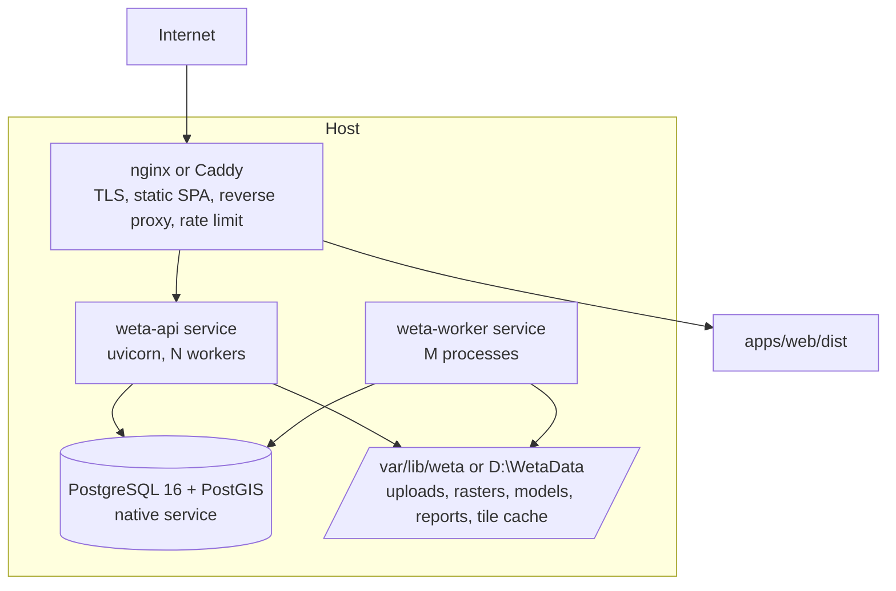

# Deployment

All components run as native processes on the host operating system. No container technology is used in development, CI or production.

## 1. Runtime topology



Single host is the starting point. Scale-out path: database on its own host; more worker processes or worker hosts sharing the file store over a network file system; several API processes behind the reverse proxy. Nothing in the design needs an orchestrator.

## 2. Prerequisites

| Component | Linux (Debian / Ubuntu) | Windows (development and small installs) |
|-----------|-------------------------|-------------------------------------------|
| PostgreSQL 16 | PGDG apt repository | EDB installer |
| PostGIS 3.4 (+ pgRouting if chosen) | `postgresql-16-postgis-3`, `postgresql-16-pgrouting` | StackBuilder PostGIS bundle |
| Python 3.12 | managed by `uv` | managed by `uv` |
| GDAL / PROJ / GEOS | Binary wheels of `rasterio`, `pyogrio`, `shapely`, `pyproj` bundle these libraries, so no system GDAL is required for the Python side. System `gdal-bin` is optional for command-line tools | Same wheels; optional OSGeo4W for tools |
| Node.js LTS + pnpm | NodeSource or `fnm`; `corepack enable` | Installer or `fnm`; `corepack enable` |
| WeasyPrint dependencies | `libpango-1.0-0`, `libpangoft2-1.0-0` | GTK runtime (MSYS2) per WeasyPrint documentation |
| Reverse proxy | nginx or Caddy package | Caddy binary or IIS with reverse proxy; for development none is needed |
| Optional | ClamAV; Valhalla or OSRM built natively; regulatory dispersion model executables | As available |

## 3. Development setup

```
git clone <repo> weta && cd weta
uv sync                                   # creates .venv, installs workspace
pnpm install
createdb weta_dev && psql weta_dev -c "CREATE EXTENSION postgis; CREATE EXTENSION pgcrypto; CREATE EXTENSION citext;"
cp .env.example .env                      # edit DATABASE_URL, SECRET_KEY, FILE_STORE
uv run alembic upgrade head
uv run python scripts/seed_system.py      # roles, permissions, units, layer types, property definitions
uv run python scripts/load_demo.py        # optional, SYNTHETIC_DEMO
uv run uvicorn weta_api.main:app --reload --port 8000
uv run python -m weta_api.jobs.worker
pnpm --filter web dev                     # Vite dev server proxies /api to :8000
```

`scripts/dev.ps1` and `scripts/dev.sh` start API, worker and web together. On Windows, PowerShell equivalents of the database commands are in `scripts/setup_windows.ps1`.

## 4. Configuration

`pydantic-settings` reading environment variables or an env file: `DATABASE_URL`, `MIGRATION_DATABASE_URL` (separate role), `SECRET_KEY`, `FILE_STORE_ROOT`, `ALLOWED_ORIGINS`, `ACCESS_TOKEN_TTL`, `REFRESH_TOKEN_TTL`, `MAX_UPLOAD_MB`, `WORKER_CONCURRENCY`, `TILE_CACHE_DIR`, `LOG_LEVEL`, provider-specific paths (dispersion executables, router URL). Production env file is owned by root and readable by the service account only.

## 5. Production on Linux

- Dedicated system user `weta`; code under `/opt/weta/releases/<version>` with a `current` symlink; virtual environment built by `uv sync --frozen --no-dev` in the release directory; SPA built with `pnpm --filter web build`.
- systemd units:

```ini
# /etc/systemd/system/weta-api.service
[Unit]
Description=Weta API
After=network.target postgresql.service
[Service]
User=weta
WorkingDirectory=/opt/weta/current
EnvironmentFile=/etc/weta/weta.env
ExecStart=/opt/weta/current/.venv/bin/uvicorn weta_api.main:app --host 127.0.0.1 --port 8000 --workers 4 --proxy-headers
Restart=on-failure
NoNewPrivileges=true
ProtectSystem=strict
ReadWritePaths=/var/lib/weta /var/log/weta
[Install]
WantedBy=multi-user.target
```

  `weta-worker@.service` is a template unit so several workers can run (`systemctl enable --now weta-worker@1 weta-worker@2`).
- Reverse proxy serves `apps/web/dist`, proxies `/api/` to `127.0.0.1:8000`, sets upload size limits and rate limits, and terminates TLS (ACME certificates).
- PostgreSQL: roles `weta_migrate` (owner, used only by Alembic) and `weta_app` (runtime, subject to RLS, no DDL); `pg_hba.conf` restricted to local or the API host; tuned `shared_buffers`, `work_mem`, `max_parallel_workers` for spatial queries.

## 6. Production on Windows Server

Services registered with the built-in service manager through a wrapper such as NSSM or WinSW (API and worker as separate services), Caddy or IIS as reverse proxy, PostgreSQL as its native Windows service, BitLocker for the data volume. Functionality is identical; Linux is the reference platform for performance testing.

## 7. Release procedure

1. CI builds and tests the tagged commit.
2. On the host: fetch release, `uv sync --frozen --no-dev`, build or copy SPA.
3. Back up the database (`pg_dump -Fc`) and note the current release.
4. `alembic upgrade head` with the migration role. Migrations are written to be backward compatible with the previous application version where possible (expand, migrate, contract).
5. Switch the `current` symlink; restart worker, then API.
6. Smoke test (`/health`, login, one stored reference calculation).
7. Rollback: switch symlink back; downgrade or restore only if the migration was not backward compatible.

Method versions, rule packs and datasets are data, released independently of code through import jobs.

## 8. Backups and recovery

Nightly `pg_dump` plus continuous WAL archiving (pgBackRest or plain archive command) for point-in-time recovery; file-store backup with `restic` or `rsync` snapshots; encrypted off-host copies; quarterly restore test recorded in the operations log. Because reports cite immutable results, a restore test includes regenerating a final report and comparing its snapshot hash.

## 9. Observability

Structured JSON logs to journald or files with rotation; `/health` (liveness) and `/health/ready` (database, file store, queue lag); optional Prometheus endpoint (`/metrics`) with native `node_exporter` and `postgres_exporter`; job dashboard in the admin UI (queue depth, failures, durations); alert on failed jobs, queue lag, disk space, backup age, audit-chain verification failure.

## 10. Capacity notes

Monte Carlo and Sobol runs are CPU-bound and scale with worker processes; raster zonal statistics are I/O-bound on the file store; tile serving benefits from the disk cache. Sizing is to be measured in Phase 11 with representative projects; no performance figures are claimed in advance.
