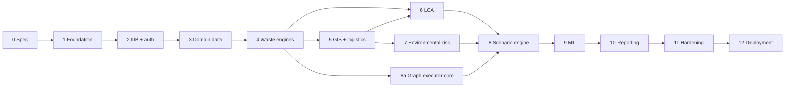

# Development phases

Each phase ends with a demonstrable, tested increment. A phase starts only when its dependencies meet their acceptance criteria.

Note: the graph executor core (node decorator, hashing, run storage) is built in Phase 4 with the first engines, because every engine depends on it. Phase 8 adds overrides, comparison and decision support on top.

## Phase 0: Architecture and scientific specification

| Item | Content |
|------|---------|
| Objectives | Agree architecture, data model, engine specifications, rules |
| Files | `docs/*`, `README.md`, `CLAUDE.md` |
| Dependencies | None |
| Database / API / UI | None |
| Tests | Document review checklist |
| Acceptance | Docs reviewed by a domain specialist per engine; open decisions listed in `docs/assumptions.md`; no invented scientific values anywhere |
| Risks | Over-specification before contact with real data. Mitigation: methods are versioned, docs change with code |

## Phase 1: Project foundation

| Item | Content |
|------|---------|
| Objectives | Monorepo, tooling, CI, skeleton apps, core package |
| Files / modules | `pyproject.toml` (uv workspace), `pnpm-workspace.yaml`, `packages/core` (Quantity, units with pint, provenance enum, node decorator, canonical hashing, NodeResult), `packages/schemas`, `apps/api` (app factory, config, health, error format, request id), `apps/web` (shell, router, design tokens, API client generation), `scripts/dev.*`, lint, type-check and import-linter configuration, CI pipeline |
| Dependencies | Phase 0 |
| Database | None yet (connection check only) |
| APIs | `GET /health`, `GET /version` |
| UI | App shell with navigation placeholders; QuantityCell and ProvenanceBadge components |
| Tests | Units round trips, dimensional errors, hash stability across platforms, provenance combination, component tests for quantity display |
| Acceptance | `uv run pytest` and `pnpm test` green on Windows and Linux; CI green; import contracts enforced; no container files in the repository |
| Risks | Windows and Linux differences in geospatial wheels. Mitigation: CI matrix on both from day one |

## Phase 2: Database and authentication

| Item | Content |
|------|---------|
| Objectives | PostgreSQL + PostGIS schema base, identity, RBAC, RLS, audit log, job queue |
| Files / modules | `packages/db` (models: identity, organizations, projects, datasets, source_refs, documents, audit_logs, jobs; repositories; Alembic), `apps/api/auth`, `routers/auth.py`, `routers/identity.py`, `routers/projects.py`, `routers/audit.py`, `jobs/queue.py`, `jobs/worker.py`, `scripts/seed_system.py` |
| Dependencies | Phase 1 |
| Database | Sections 2.1, parts of 2.2, 2.6 (`datasets`, `dataset_versions`), 2.10 (`source_refs`, `documents`, `audit_logs`), `jobs`; RLS policies; append-only triggers |
| APIs | Auth, identity, projects, audit, jobs |
| UI | Login, MFA, organization and user administration, project list and creation, audit viewer |
| Tests | Auth flows, permission matrix, RLS isolation generated per table, audit hash chain, job claim and retry semantics |
| Acceptance | Cross-tenant access impossible in tests at both API and SQL level; every mutation produces an audit row; a job survives a worker restart |
| Risks | RLS and connection pooling interplay. Mitigation: `SET LOCAL` per transaction, tested under concurrency |

## Phase 3: Facility, process, material and waste management

| Item | Content |
|------|---------|
| Objectives | Enter and import all layer A data with provenance |
| Files / modules | `packages/db` models for sections 2.2 to 2.5 (data only), routers for facilities, production, materials, chemicals, waste, logistics master data; CSV and XLSX import templates in `data/schemas`; `packages/providers/chemicals` (first importer plus user-entry path); `scripts/load_demo.py` |
| Dependencies | Phase 2 |
| Database | Facilities, processes, steps, materials, chemicals, properties, compositions, records, waste streams and compositions, emissions, wastewater, treatment and disposal facilities, vehicles |
| APIs | Facilities, production, materials, waste, data import |
| UI | Facilities, Production, Materials, Waste pages with forms, tables, import wizard, document attachment, provenance badges, confidential flags |
| Tests | CRUD and validation per route, composition constraints, CAS validation, import round trips, provenance required |
| Acceptance | A complete fictional facility can be entered and re-exported; every numeric field has unit and provenance; chemical properties show all sources |
| Risks | Data entry burden. Mitigation: templates, bulk import, copy from existing process |

## Phase 4: Waste-generation engines and graph core

| Item | Content |
|------|---------|
| Objectives | Engines 1 to 3; calculation graph executor; result storage and trace |
| Files / modules | `engines/waste` (material_balance, generation, characterization), `engines/scenarios/graph.py`, `executor.py`, `state.py` (baseline only), `engines/regulatory/evaluator.py` (generic evaluator needed by characterization), `packages/db` (calculation_runs, calculation_run_inputs, result_values, assumptions, run_assumptions, method_versions, regulatory tables), `routers/results.py`, `routers/traceability.py` |
| Dependencies | Phase 3 |
| Database | Sections 2.7 (runs, results, assumptions, methods), 2.10 (regulatory) |
| APIs | `POST /scenarios/{id}/run` (baseline), results, trace, rule-pack import |
| UI | Mass-balance Sankey, waste generation tiers, classification results with triggering rules, trace panel, data-gap lists |
| Tests | Reference cases for engines 1 to 3; mass-conservation properties; evaluator on synthetic rule sets; hash reuse; trace completeness |
| Acceptance | Baseline results reproduce hand calculations; every result traces to inputs; missing coefficients yield `insufficient_data` |
| Risks | Transfer-coefficient data scarcity. Mitigation: explicit gaps, ranges, later ML tier |

## Phase 5: GIS and logistics

| Item | Content |
|------|---------|
| Objectives | Layer import, receptors, derived variables, map, routing, logistics engine |
| Files / modules | `packages/providers/gis` (vector, raster importers), `engines/gis` (derive operations, vulnerability), `engines/logistics`, routing provider (decision D-05), tile routers, `packages/providers/emission_factors`, `packages/providers/transport_risk` |
| Dependencies | Phases 3, 4 |
| Database | Section 2.6 complete; routes, legs, segments, events; emission factor and incident rate tables |
| APIs | GIS, tiles, logistics, routes |
| UI | GIS page with layer tree, import wizard, receptor tools, route view; logistics chain editor; exposure indicators |
| Tests | Synthetic geometry cases, raster statistics, import validation, QGIS cross-checks, logistics hand cases, double-counting guard, staleness propagation |
| Acceptance | Importing a new dataset version marks the right variables stale; derived variables carry dataset versions; logistics reports "not quantified" without incident-rate data |
| Risks | Spatial data quality and licensing; routing data restrictions for hazardous goods. Mitigation: provider metadata, user-drawn routes as fallback |

## Phase 6: LCA

| Item | Content |
|------|---------|
| Objectives | Import LCI and LCIA data; build inventory; impact assessment; contributions |
| Files / modules | `packages/providers/lca` (importers, flow mapping), `engines/lca` (foreground builder, solver or backend wrapper per D-03, lcia, contributions) |
| Dependencies | Phases 4, 5 |
| Database | Section 2.8 LCA tables |
| APIs | LCA group |
| UI | LCA page: goal and scope, mapping, inventory, impacts, contributions, uncharacterized flows |
| Tests | Hand-solved systems, publisher score reproduction, external tool cross-check, version pinning, licence flags in exports |
| Acceptance | Reference dataset scores reproduced within numerical tolerance; inventory viewable without impact method; unmatched flows listed |
| Risks | Licensed data availability; flow-mapping gaps. Mitigation: open datasets for development, official mapping files |

## Phase 7: Environmental risk

| Item | Content |
|------|---------|
| Objectives | Engines 5 to 9, 11, 12; release scenarios; dispersion interface with screening model |
| Files / modules | `engines/fate`, `engines/risk` (groundwater, surface_water, air, ecotox, aggregate), `packages/providers/dispersion` (interface + gaussian_screening), `packages/providers/effect_values` |
| Dependencies | Phases 4, 5 |
| Database | `risk_assessments`, `risk_matrices`, release scenarios, vulnerability schemes |
| APIs | Risk group |
| UI | Risk profile, linkage tables, pathway detail with scope statements, maps |
| Tests | Reference cases for every equation branch, validity-range refusals, completeness logic, adapter contract tests |
| Acceptance | Specialist review of each pathway method signed off; screening labels present everywhere; missing data never lowers a risk class |
| Risks | Misuse of screening results as predictions. Mitigation: tier labels, scope statements, refusal outside validity |

## Phase 8: Scenario engine

| Item | Content |
|------|---------|
| Objectives | Overrides, duplication, combined scenarios, incremental recalculation, comparison, uncertainty, sensitivity, decision support |
| Files / modules | `engines/scenarios` (overrides, resolver, affected-set preview, compare, graph diff, decision), `engines/uncertainty` (sampling, propagation, convergence, sensitivity with SALib) |
| Dependencies | Phases 4 to 7 |
| Database | `scenarios` (alternatives), `scenario_inputs`, `scenario_components`, uncertainty and sensitivity tables, `decision_analyses` |
| APIs | Scenarios, comparison, decision analyses, uncertainty, sensitivity |
| UI | Scenarios page complete: override editor, substitution checklist, graph view, comparison, decision support |
| Tests | Section 7 of `docs/testing.md` |
| Acceptance | The solvent-substitution example runs end to end on demo data, recalculating only affected nodes (asserted); comparison shows absolute and percent changes with intervals; "why it changed" path displayed; ranking never shown without matrix and weights |
| Risks | Graph complexity and performance. Mitigation: per-subject node granularity, hash reuse, job execution |

## Phase 9: Machine learning

| Item | Content |
|------|---------|
| Objectives | Dataset builder, training, registry, inference node, SHAP, monitoring |
| Files / modules | `engines/ml` (datasets, features, train, validate, conformal, registry, infer, explain, monitor) |
| Dependencies | Phases 3, 4, 8 |
| Database | Section 2.9 |
| APIs | ML group |
| UI | ML page |
| Tests | Section 6 of `docs/testing.md` |
| Acceptance | A model trained on synthetic data is permanently flagged demo; metrics shown equal metrics stored; out-of-domain inputs flagged; SHAP additivity holds; no model promoted without beating baseline and human approval |
| Risks | Insufficient real data. Mitigation: gates, honest "not enough data" state, deterministic tiers remain primary |

## Phase 10: Reporting

| Item | Content |
|------|---------|
| Objectives | Report model, templates, PDF, Excel, CSV, JSON, approval workflow |
| Files / modules | `engines/reporting` (model, sections, renderers, templates), static map and chart rendering |
| Dependencies | Phases 4 to 9 |
| Database | Reports, snapshots, exports, templates |
| APIs | Reports group |
| UI | Reports page |
| Tests | Section 8 of `docs/testing.md` |
| Acceptance | All four formats agree; watermark and final-status blocking work; a final report regenerates identically from its snapshot; trace references resolve |
| Risks | PDF layout effort. Mitigation: HTML and CSS templates, golden tests |

## Phase 11: Testing, security and performance hardening

| Item | Content |
|------|---------|
| Objectives | Close test gaps, threat model, load and scale tests, accessibility, documentation |
| Files / modules | `tests/security`, `tests/perf`, operations manual, user guide |
| Dependencies | All previous |
| Database | Index and partition tuning |
| APIs | Rate limits and quotas finalized |
| UI | Accessibility fixes, empty and error states |
| Tests | Full matrix; nightly reproducibility checks |
| Acceptance | OWASP ASVS checklist reviewed; measured performance documented for a representative project; restore test passed |
| Risks | Late discovery of scale limits. Mitigation: perf tests start in Phase 5 on spatial queries |

## Phase 12: Deployment

| Item | Content |
|------|---------|
| Objectives | Native production installation, backups, monitoring, release procedure |
| Files / modules | `scripts/deploy/*`, systemd units, proxy configuration, backup scripts, runbooks |
| Dependencies | Phase 11 |
| Database | Production roles, backup configuration |
| APIs | Health and readiness |
| UI | Admin job monitor and system status |
| Tests | Install from scratch on a clean Linux host and a clean Windows host; upgrade and rollback rehearsal |
| Acceptance | Installation reproducible from the runbook with no container tooling; backups restorable; alerts firing in a drill |
| Risks | Environment drift between hosts. Mitigation: lock files, scripted setup, version endpoint reporting all component versions |
