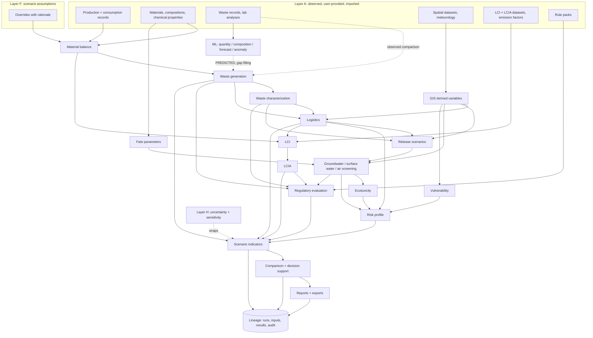

# Diagram index

All diagrams are Mermaid blocks inside the documents, so they version with the text and render on common Git hosts and in most Markdown viewers.

| Diagram | Location |
|---------|----------|
| System architecture (high level) | [architecture.md, section 3](architecture.md#3-high-level-architecture) |
| Component architecture and dependency rules | [architecture.md, section 4](architecture.md#4-component-architecture) |
| Authentication sequence | [architecture.md, section 8](architecture.md#8-authentication-architecture) |
| Provenance flow | [architecture.md, section 10](architecture.md#10-data-provenance-architecture) |
| ERD | [data-model.md, section 3](data-model.md#3-erd) |
| End-to-end data flow | below |
| Engine dependency map | [environmental-models.md](environmental-models.md#engine-dependency-map) |
| Scenario calculation graph (dependency map) | [scenario-engine.md, section 3](scenario-engine.md#3-calculation-graph) |
| Scenario-processing flow | [scenario-engine.md, section 4](scenario-engine.md#4-dependency-tracking-and-incremental-recalculation) |
| Scenario lifecycle sequence | [api.md](api.md#example-scenario-lifecycle) |
| ML pipeline | [ml.md, section 3](ml.md#3-pipeline) |
| GIS import pipeline | [gis.md, section 3](gis.md#3-import-pipeline) |
| GIS derived-variable pipeline | [gis.md, section 4](gis.md#4-derived-variable-pipeline) |
| Environmental risk pipeline | [risk-engine.md](risk-engine.md#environmental-risk-pipeline) |
| LCA stages and provider architecture | [lca.md](lca.md) |
| Logistics chain | [logistics.md](logistics.md#1-chain-model) |
| Regulatory evaluation flow | [regulatory-engine.md](regulatory-engine.md#3-evaluation) |
| Report pipeline | [reporting.md](reporting.md#1-pipeline) |
| Deployment topology | [deployment.md](deployment.md#1-runtime-topology) |
| Phase dependencies | [development-phases.md](development-phases.md) |
| API structure | [api.md](api.md#route-map) |

## End-to-end data flow

## Dependency map: what recalculates when an input changes

| Changed input | Recalculated | Reused |
|---------------|--------------|--------|
| Production volume | Everything quantity-dependent: balance, generation, logistics activity, releases, air emissions, LCA, indicators | Characterization (composition unchanged), fate parameters, GIS variables, vulnerability |
| Raw material or chemical substitution | Balance, generation, characterization, treatment compatibility, logistics (if class or destination changes), fate, all risk pathways, LCA, regulatory | GIS variables, vulnerability, route geometry if destination unchanged |
| Process parameter or transfer coefficient | Balance and all downstream of the affected step | Other steps, GIS, routes |
| Treatment technology or facility | Treatment assignment, logistics leg to it, air emissions, LCA treatment stage, residues, regulatory | Balance, generation, characterization |
| Transport mode, vehicle, route, frequency | Logistics activity, emissions, exposure, transport releases and their risks, LCA transport stage | Balance, generation, characterization, storage, treatment |
| Disposal route | Disposal-related releases and risks, LCA disposal stage, regulatory | Upstream of disposal |
| Containment | Storage release scenarios, groundwater and surface-water risk from that source | Everything else |
| Emission controls | Air emissions, dispersion, air-pathway ecotoxicity and regulatory, LCA direct emissions | Everything else |
| New spatial dataset version | Derived variables using it, then vulnerability, logistics exposure, risk | Balance, generation, characterization, LCA |
| New LCIA method version | LCIA only | Inventory and everything else |
| New rule pack version | Regulatory evaluations (and classification if rules feed it) | Everything else |
| New production ML model version | Nodes consuming that prediction and their dependants | Everything else |
