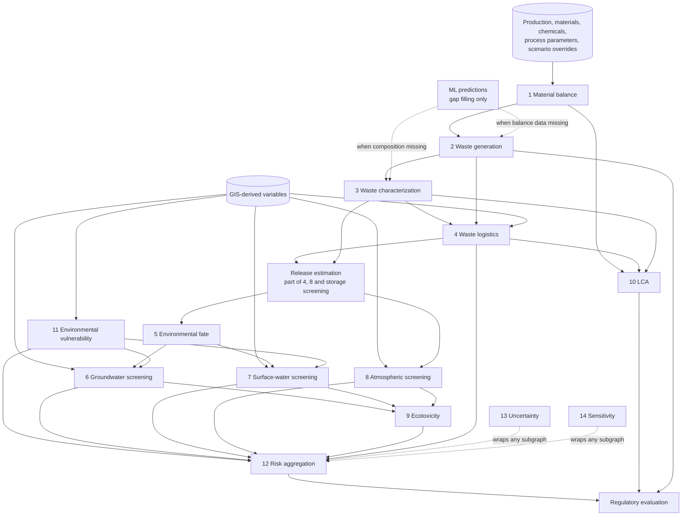

# Environmental models

This document specifies the 14 engines. Engines 1, 2, 3, 5 and 11 are specified in full here. Engines 4, 6 to 10 and 12 to 14 are summarized here and specified in full in their own documents, so that each calculation has exactly one authoritative description.

General rules for all engines:

- Tiering. Every model output carries `tier`: `screening` (conservative, few inputs, for prioritization) or `refined` (validated external model through an adapter). Weta's built-in models are screening tier unless stated otherwise.
- No embedded scientific constants. Chemical properties, emission factors, characterization factors, default soil parameters and thresholds are supplied by the provider layer with a `dataset_version`. The equations below are published, standard forms; their parameters are data.
- Status instead of guesses: `ok`, `insufficient_data`, `out_of_validity_range`, `not_applicable`.
- Units are given in SI-coherent form; storage uses the canonical unit for each dimension.

## Engine dependency map

---

## 1. Material balance engine

Node ids: `waste.material_balance.step`, `waste.material_balance.process`.

**Purpose.** Account for every input mass through each process step to product, by-product, waste, emission and wastewater outputs. This is the upstream anchor of the platform: a substitution or a parameter change enters here.

**Inputs**

| Input | Unit | Source |
|-------|------|--------|
| Production output per period, P | functional units per period | `production_records` or scenario |
| Step inputs per functional unit, a_m | kg/FU | `step_inputs` |
| Material composition, x_(m,i) | kg/kg | `material_compositions` |
| Transfer coefficients, TC_(i,j) | dimensionless, 0 to 1 | `transfer_coefficients` |
| Reaction definitions (optional): stoichiometry, conversion | mol/mol, fraction | user-provided with source |
| Observed consumption (optional, for reconciliation) | kg per period | `material_consumption_records` |

**Calculations**

- Substance input to a step: `M_in,i = P * sum_m (a_m * x_(m,i))` [kg per period].
- Distribution to output j: `M_out,i,j = M_in,i * TC_(i,j)`, with `sum_j TC_(i,j) = 1` for a non-reacting substance.
- With a defined reaction, consumed and formed masses follow the supplied stoichiometry and conversion; mass is conserved in total, not per substance.
- Step closure: `closure = (sum M_in - sum M_out - accumulation) / sum M_in`. Reported, never forced to zero.
- Reconciliation with observations: where observed consumption exists, the engine reports the difference between design and observed values. It does not overwrite either.

**Outputs.** Mass flow per substance per output per step [kg per period]; closure error [%]; list of substances with undefined transfer coefficients.

**Assumptions.** Steady state over the period unless accumulation is given; transfer coefficients independent of throughput within the stated validity range.

**Uncertainty.** Propagated from input distributions through Engine 13. Transfer coefficients are usually the dominant uncertainty and should carry at least a range.

**Dependencies.** None upstream. Feeds 2, 3, 10.

**Data requirements.** A bill of materials, compositions (from safety data sheets or analyses) and transfer coefficients (from process design, measurements, or sector reference documents such as EU BREFs, entered with source).

**Validation.** Hand-calculated reference cases; property-based tests for mass conservation; comparison against facility records where available.

**Limitations.** Not a process simulator. No thermodynamics, kinetics or equilibrium. A solvent substitution changes results only through the data the user supplies for the new solvent (composition, quantities, transfer coefficients). The engine flags transfer coefficients that were inherited from the replaced material as an explicit `SCENARIO_ASSUMPTION` needing review.

## 2. Waste generation engine

Node id: `waste.generation`.

**Purpose.** Quantity of each waste stream, emission and wastewater per period.

**Method hierarchy** (highest available tier is used; the tier used is stored):

1. Mass balance: sum of `M_out,i,j` over substances for waste output j (Engine 1).
2. Observed specific generation factor: `w_k = sum(W_k observed) / sum(P observed)` over a stated reference period, then `W_k = w_k * P_scenario`. Valid only if the scenario does not change what drives w_k; the engine checks which scenario overrides touch the stream's upstream steps and downgrades the result status if they do.
3. ML prediction (see `docs/ml.md`), tagged `PREDICTED`, only when a production model exists for this organization and the input is within the applicability domain.
4. Imported reference factor (sector documents), tagged `IMPORTED`, with the source's stated range.

**Outputs.** Waste quantity per stream [kg or t per period], method tier, specific generation [kg/FU].

**Uncertainty.** Tier 1 from propagation; tier 2 from the dispersion of observed period factors; tier 3 from prediction intervals; tier 4 from the source range.

**Validation.** Back-testing against withheld observed periods; reported as measured error, never asserted in advance.

**Limitations.** Tier 2 assumes linear scaling with production; non-linear effects (batch cleaning, start-up waste) need explicit parameters or the ML tier.

## 3. Waste characterization engine

Node ids: `waste.characterization.composition`, `waste.characterization.hazard`, `waste.characterization.treatment_compatibility`.

**Purpose.** Composition, physical state, hazard properties, classification code candidates, and compatible treatment routes.

**Inputs.** Substance flows to the stream (Engine 1) or observed composition; chemical hazard classifications (imported, GHS / CLP); classification rule sets (imported, per jurisdiction: for the EU, the hazardous-property criteria of the Waste Framework Directive Annex III and the List of Waste; for transport, UN / ADR classes); treatment acceptance criteria.

**Calculations**

- Composition: `c_i = M_i / sum_i M_i` [kg/kg].
- Hazard properties: evaluated by the regulatory rule engine against imported concentration limits and summation rules for the selected scheme. The rule logic is generic (single-substance limit, additive sum over substances with a given hazard statement, cut-off values); every limit value is rule data, not code.
- Treatment compatibility: rule evaluation against technology acceptance criteria (for example halogen content, calorific value, water content) that are stored as data per technology or per facility permit.

**Outputs.** Composition table; list of hazard properties with the triggering substances and rule; candidate waste codes (the user confirms; the system does not auto-assign a legal classification); transport class candidates; compatible technologies with reasons for exclusion.

**Assumptions.** Composition is homogeneous; unidentified mass fraction is carried as `UNSPECIFIED` and blocks a "non-hazardous" conclusion above a configurable fraction.

**Limitations.** Calculation-based classification does not replace testing where regulation requires tests (for example flash point, leaching). The output is decision support for a qualified person.

## 4. Waste logistics engine

See `docs/logistics.md`. Outputs: trips, vehicle-km, tonne-km, storage time, transport emissions inventory, corridor exposure variables, incident and release frequency estimates.

## 5. Environmental fate engine

Node ids: `fate.partitioning`, `fate.degradation`, `fate.retardation`.

**Purpose.** Screening description of where a released chemical tends to go and how fast it attenuates. It supplies parameters to Engines 6 and 7. It is not a transport simulator.

**Inputs.** Chemical properties from the provider layer: organic carbon partition coefficient Koc [L/kg], octanol-water coefficient log Kow, Henry's law constant [Pa m3/mol], water solubility [mg/L], vapour pressure [Pa], degradation half-lives per compartment [d]. Site properties: soil organic carbon fraction f_oc, bulk density rho_b [kg/L], volumetric water content theta, from soil datasets or user entry.

**Calculations** (standard published relations)

- Soil-water distribution for non-ionic organics: `Kd = Koc * f_oc` [L/kg].
- Retardation factor: `R = 1 + (rho_b / theta) * Kd` [dimensionless].
- First-order decay: `C(t) = C0 * exp(-k t)`, `k = ln(2) / t_half`.
- Dimensionless Henry constant: `H' = H / (R_gas * T)`.
- Optional compartment distribution: a Level I fugacity calculation (Mackay) over a unit world defined as method parameters, used only to indicate the dominant compartment, labelled as indicative.

**Outputs.** Kd, R, k per compartment, dominant-compartment indication, mobility and persistence classes (class boundaries are imported from the chosen classification scheme, not hard-coded).

**Assumptions.** Linear, reversible, equilibrium sorption; first-order degradation; the `Kd = Koc * f_oc` relation is valid for neutral organics only. For ionizable organics, metals and surfactants the node returns `out_of_validity_range` unless a measured Kd is supplied.

**Uncertainty.** Property values from different sources can differ by orders of magnitude; all source values are kept and the range feeds Engine 13.

**Validation.** Reference cases recomputed by hand and against a published worked example recorded in `tests/reference_cases/fate/`.

**Limitations.** No multi-phase flow, no non-aqueous phase liquid behaviour, no preferential flow, no transformation products unless supplied.

## 6. Groundwater screening risk

See `docs/risk-engine.md#groundwater`. Intrinsic vulnerability index plus piston-flow travel time, retardation, decay and dilution-attenuation screening. Explicitly not a plume model.

## 7. Surface-water screening risk

See `docs/risk-engine.md#surface-water`. Overland pathway indicators from terrain, mass-balance mixing for a predicted environmental concentration, comparison to imported no-effect concentrations.

## 8. Atmospheric / emission screening

See `docs/risk-engine.md#atmospheric`. Emission estimation from activity data and imported emission factors, optional screening dispersion, and an adapter interface for validated dispersion models.

## 9. Ecotoxicity

See `docs/risk-engine.md#ecotoxicity`. Risk quotients per compartment and substance, first-tier mixture assessment, link to LCA ecotoxicity characterization.

## 10. LCA

See `docs/lca.md`.

## 11. Environmental vulnerability engine

Node ids: `gis.vulnerability.<theme>` where theme is `groundwater`, `surface_water`, `ecological`, `human`.

**Purpose.** Describe how sensitive the surroundings of a source (facility, storage unit, route segment, treatment site) are, independent of any specific chemical. Vulnerability is one factor in risk, not risk itself.

**Inputs.** GIS-derived variables (see `docs/gis.md`): distances to receptors by type, receptor counts and population within buffers, land cover shares, slope, flood zone membership, protected-area overlap, imported groundwater vulnerability class or its components.

**Calculations**

- Each indicator is mapped to an ordinal class by a published or organization-defined classification table (stored in `vulnerability_schemes`, versioned, with source).
- The theme result is reported first as the full indicator profile.
- An optional index is a weighted linear combination `V = sum_k (w_k * r_k)` of class ratings with weights from the selected scheme. For groundwater, recognized schemes such as DRASTIC or GOD can be configured as schemes, with their ratings and weights imported from the cited publications. Organization-defined schemes must be labelled as such and carry a rationale.

**Outputs.** Indicator table with classes; optional index with its scheme id; limiting indicator; map layer of vulnerability per source.

**Assumptions.** Additive index schemes assume indicators compensate for each other. The profile view exists because that assumption is often wrong.

**Uncertainty.** Positional and thematic accuracy of source layers (from dataset metadata) is recorded; class changes under perturbation of distances are reported as a stability flag.

**Validation.** Reproduction of published worked examples for any imported scheme; GIS unit tests on synthetic geometries with known answers.

**Limitations.** Index values are ordinal. Differences between index values have no physical unit and must not be read as proportional differences in risk.

## 12. Risk aggregation

See `docs/risk-engine.md#aggregation`. Likelihood and consequence classes per pathway and receptor using a versioned risk matrix; pathway profile per scenario; no mandatory single score.

## 13. Uncertainty

See `docs/risk-engine.md#uncertainty`. Distribution-carrying quantities, Monte Carlo with Latin hypercube sampling, convergence checks, interval reporting.

## 14. Sensitivity analysis

See `docs/risk-engine.md#sensitivity`. One-at-a-time, Morris screening, Sobol indices via SALib.
