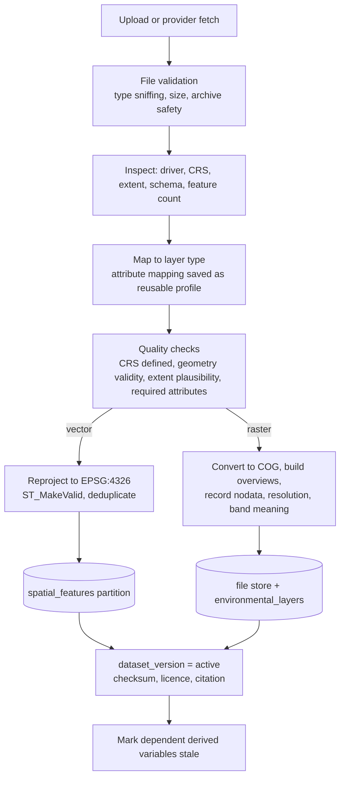
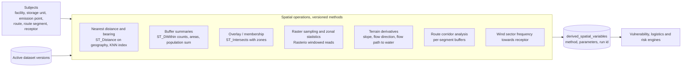

# GIS architecture

PostGIS is the system of record for vector data and for all spatial relationships. Rasters are stored as Cloud-Optimized GeoTIFF files in the file store and processed with Rasterio. GeoPandas and Shapely are used in import and in engine code on in-memory geometries. Package `engines/gis`, importers in `packages/providers/gis`.

## 1. Three kinds of spatial information

| Kind | Tables | Provenance | Mutability |
|------|--------|------------|------------|
| Source data | `datasets`, `dataset_versions`, `environmental_layers`, `spatial_features`, raster files, `meteorological_series` | `IMPORTED` (or `USER_PROVIDED` for drawn features, `OBSERVED` for surveyed) | Immutable per version |
| Derived GIS variables | `derived_spatial_variables`, `spatial_variable_inputs` | `DERIVED` | Recomputed when a source version or subject geometry changes |
| Model outputs | `result_values`, `risk_assessments` | `MODELLED` | Per calculation run |

The map legend groups layers under these three headings.

## 2. Layer catalogue

Layer types are a controlled list (`layer_types`). Candidate sources are in `docs/data-sources.md`; none is bundled.

| Layer type | Geometry | Typical required attributes |
|------------|----------|-----------------------------|
| facilities, storage units, emission points | Point / Polygon | From domain tables |
| treatment and disposal facilities, transfer stations | Point | From domain tables |
| waste routes, route segments | LineString | road class, length |
| roads / transport network | LineString (routable graph) | class, restrictions (hazardous goods, tunnels, weight) |
| rivers, streams | LineString | name, order, flow statistics if available |
| lakes, reservoirs | Polygon | name |
| aquifers | Polygon | type (porous, fractured, karst), productivity |
| groundwater vulnerability | Polygon or raster | class, scheme |
| groundwater depth | Raster or points | depth |
| drinking-water abstraction and protection zones | Point / Polygon | zone class |
| wetlands | Polygon | type |
| protected areas | Polygon | designation, category |
| forests, land cover | Raster or polygon | class code, nomenclature |
| soil | Raster or polygon | texture, organic carbon, bulk density |
| elevation | Raster | DEM; slope, flow direction, flow accumulation are derived |
| flood susceptibility | Polygon or raster | return period |
| population | Raster | persons per cell |
| settlements | Polygon | name, type |
| schools, hospitals | Point | type |
| ecosystems / habitats | Polygon | habitat type, status |
| meteorological variables | Station points or grid | wind speed and direction frequencies, precipitation, temperature |

## 3. Import pipeline

Runs as a `gis.import` job. Geometry repairs are counted and reported. Features that cannot be repaired are rejected and listed.

## 4. Derived variable pipeline

Variable catalogue (codes are stable identifiers; all carry units and method version):

| Code | Subject | Definition | Unit |
|------|---------|------------|------|
| `dist_nearest_<type>` | any | Geodesic distance to nearest feature of layer type | m |
| `bearing_nearest_<type>` | any | Bearing to that feature | degree |
| `count_<type>_within_<r>` | any | Features within radius r | count |
| `pop_within_<r>` | any | Population raster sum within r (cell-fraction weighted) | persons |
| `area_share_<class>_within_<r>` | any | Land-cover class share within r | fraction |
| `in_<zone>` | any | Membership in protected area, flood zone, water protection zone | boolean |
| `overlap_length_<zone>` | route | Route length inside zone | m |
| `soil_<property>` | point subjects | Sampled soil property | per property |
| `gw_depth`, `gw_vuln_class` | point subjects | Sampled from imported layers | m, class |
| `slope_mean_<r>` | point subjects | Mean slope within r | percent |
| `flowpath_length_to_water` | point subjects | Length of steepest-descent path on the DEM to the nearest mapped water body | m |
| `watercrossings` | route | Number of route and watercourse intersections | count |
| `pop_corridor_<w>` | route segment | Population within corridor half-width w | persons |
| `wind_freq_towards` | source and receptor pair | Share of time wind blows from source towards receptor sector | fraction |

Rules:

- Distances and areas are computed on `geography` or in the project's working projected CRS, never in degrees.
- Radii and corridor widths are method parameters stored with the variable. They are assumptions and appear in the assumption register.
- Raster-derived values record the source resolution. A buffer smaller than about two cells of the source raster returns a warning rather than a falsely precise number.
- Each derived value stores the dataset versions it used. When a new dataset version is activated, dependents become stale and the scenario graph shows them as needing recalculation.
- Positional uncertainty: where dataset metadata gives positional accuracy, distance variables carry it as an interval.

## 5. Supported operations (API level)

Spatial join, buffering, distance and nearest-neighbour, proximity ranking, route analysis (see logistics), raster sampling, zonal statistics, vulnerability overlay (Engine 11), receptor analysis (which receptors fall within pathway-specific search distances of each source), spatial scenario comparison.

Spatial scenario comparison: two scenarios are compared on (a) changed geometries (routes, destinations), (b) per-receptor result differences, (c) corridor exposure differences. The map shows a difference layer where each receptor or segment is symbolized by change class, with the baseline and scenario values in the popup.

## 6. Serving maps

- Vector tiles straight from PostGIS: `ST_AsMVT` over `ST_TileEnvelope`, with per-zoom simplification, cached on disk by `(layer version, z, x, y)`.
- Raster tiles rendered from COGs by a small FastAPI router using `rio-tiler`.
- Base map: any open tile source configured by the organization; no dependency on a commercial key.
- Org scoping: tile endpoints apply the same authorization as data endpoints; private layers never share cache keys across organizations.

## 7. Routing

`RoutingProvider` interface with two implementations planned:

1. `pgrouting`: OSM-derived network loaded into PostGIS, with cost functions and restriction attributes (hazardous-goods bans, tunnel categories, weight limits) where the source data has them.
2. External open-source router installed natively (for example Valhalla or OSRM) behind an HTTP adapter.

A computed route stores the network dataset version, profile and engine version, so the same route can be reproduced. Users can also draw or upload a route; such routes are `USER_PROVIDED`.

## 8. Validation and limitations

- Synthetic-geometry unit tests with analytically known answers (distances, buffer areas, intersections, zonal sums).
- Cross-checks of selected derived variables against QGIS in Phase 5, recorded as reference cases.
- Limitations: results inherit the scale, date and completeness of source layers. Absence of a mapped receptor is not evidence of absence. The UI shows dataset date and coverage next to "none found within r".
