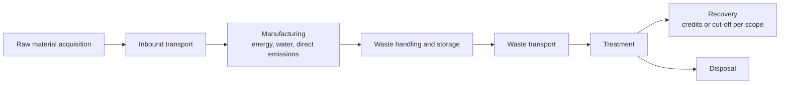
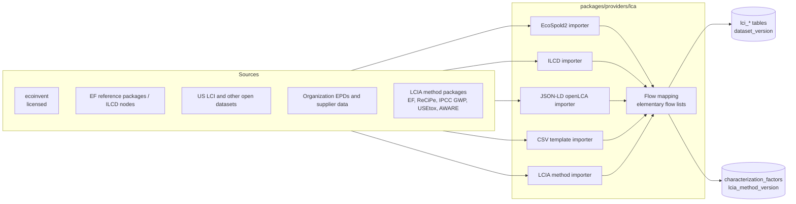

# LCA subsystem

Follows the structure of ISO 14040 / 14044: goal and scope, life-cycle inventory (LCI), life-cycle impact assessment (LCIA), interpretation. Package `engines/lca`.

## 1. Strict separation

| Concept | Tables | Origin |
|---------|--------|--------|
| Goal and scope | `lca_goal_scopes` | User |
| Foreground activities | Weta domain data (material use, transport, treatment) | Engines 1 to 4 |
| Activity to process mapping | `lci_activity_links` | User, assisted by search; auditable |
| Background inventory | `lci_processes`, `lci_flows`, `lci_exchanges` | Imported LCI dataset version |
| Inventory result | `lci_results` | Calculated |
| Characterization factors | `lcia_methods`, `lcia_method_versions`, `impact_categories`, `characterization_factors` | Imported LCIA method version |
| Impact result | `lcia_results` | Calculated |

Inventory, factors and impact results never share a table. A user can inspect the inventory without any impact method applied, and can re-run impact assessment with another method version without rebuilding the inventory.

## 2. System boundary and stages



Each inventory and impact row is tagged with `life_cycle_stage` so results can be reported per stage. The default boundary is cradle-to-gate for materials plus gate-to-grave for waste. Product use and product end of life are outside the default boundary, and the report states this.

Functional unit: defined in the goal and scope (for example "1 t of product X" or "one year of operation at baseline output"). Scenario comparison is valid only between scenarios with the same functional unit and boundary; the comparison endpoint enforces this.

Multifunctionality (recovery, by-products): the rule is chosen in the goal and scope: cut-off, system expansion with substitution, or allocation by mass or economic value. The choice is stored and printed. Results under different rules are not comparable and are blocked from comparison.

## 3. Impact categories

Supported as data, according to what the imported method version provides: climate change (GWP), energy use (cumulative energy demand or resource use, fossils), water use, acidification, eutrophication (freshwater, marine, terrestrial), photochemical ozone formation, resource use (minerals and metals), ecotoxicity (freshwater), human toxicity (cancer, non-cancer).

Categories, indicators and units are whatever the method version defines. The application has no hard-coded category list beyond a mapping from method category codes to the display groups above.

## 4. Calculation

Matrix formulation (Heijungs and Suh):

- Technology matrix A (processes by product flows), intervention matrix B (elementary flows by processes), final demand vector f.
- Scaling vector: `s = A^-1 f`. Inventory: `g = B s`. Impact: `h = Q g`, where Q is the characterization matrix (impact categories by elementary flows).

Implementation:

1. Foreground builder: converts engine outputs to demand on linked LCI processes plus direct elementary flows.
   - material consumption [kg] -> linked production processes;
   - transport [t km by vehicle class] -> linked transport processes, or direct emissions from the logistics engine when a transport emission-factor provider is configured (one or the other per leg, never both; the builder enforces it);
   - energy and water use -> linked supply processes;
   - direct process emissions from Engine 1 -> elementary flows;
   - waste to treatment [kg by technology] -> linked treatment processes.
2. Solver: sparse LU (scipy) when unit-process datasets are used. When the imported dataset provides aggregated system processes (cradle-to-gate results), A is the identity for background and the solve is trivial.
3. Contribution analysis: by process, by stage, by elementary flow.
4. Optional normalization and weighting only if the imported method provides the sets; off by default; never mixed into the characterized results.

The design may wrap Brightway (open-source LCA framework) as the calculation backend behind the `LcaBackend` interface if that proves more robust than an in-house solver. Decision recorded in Phase 6 as an ADR.

## 5. Provider and import architecture



```python
class LciProvider(Protocol):
    code: str
    def inspect(self, path: Path) -> DatasetManifest: ...      # publisher, version, licence, counts
    def import_(self, path: Path, dv: DatasetVersion) -> ImportReport: ...

class LciaMethodProvider(Protocol):
    code: str
    def import_(self, path: Path, dv: DatasetVersion) -> ImportReport: ...
```

Rules:

- The user supplies the dataset files and confirms the licence. Weta ships no licensed data.
- Elementary-flow matching between an LCI dataset and an LCIA method uses official mapping files (for example those published for the EF flow list or by the GLAD initiative). Unmatched flows are listed in the import report and in every result as "uncharacterized flows", with their inventory amounts, so that a missing factor is visible and not silently counted as zero impact.
- Regionalized factors (for example water scarcity, AWARE) are applied only when both the flow and the activity have a region; otherwise the method's global default is used and flagged.
- Each `lca_assessment` pins one LCI dataset version and one LCIA method version. Mixing versions inside one assessment is rejected.

## 6. Uncertainty and data quality

- Exchange uncertainty from the source dataset (commonly lognormal) is kept in `uncertainty_specs` and sampled in Monte Carlo runs. Sampling is supported for unit-process data; for aggregated datasets only foreground uncertainty is propagated and the report says so.
- Mapping quality: each `lci_activity_links` row has a `match_quality` (exact, proxy by technology, proxy by geography, generic proxy) and a free-text rationale. Proxy share of each impact result is reported.
- Characterization-factor uncertainty is generally not provided by methods and is not invented; categories known for high model uncertainty (toxicity) carry the method developers' own caution text in the UI.

## 7. Validation

- Reproduce published results of the imported datasets: calculating a dataset's own reference process must reproduce the publisher's LCIA scores within numerical tolerance.
- Cross-check selected cases against an independent tool (openLCA or Brightway) and store the comparison in `tests/reference_cases/lca/`.
- Unit tests on the matrix solver with small hand-solved systems.

## 8. Limitations

- Potential impacts per functional unit, not predicted local effects. Site-specific risk belongs to the risk engine.
- Results depend on the background database version and the system model of that database.
- A chemical with no matching LCI process cannot be assessed. The system reports the gap and offers proxy mapping only as an explicit, labelled user decision.
