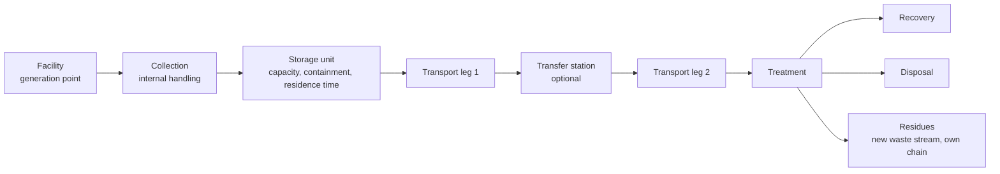

# Waste logistics engine

Package `engines/logistics`. Node ids: `logistics.chain`, `logistics.activity`, `logistics.emissions`, `logistics.exposure`, `logistics.incident`.

## 1. Chain model

A chain is an ordered list of legs between typed nodes. Residues from treatment (for example incineration bottom ash) are modelled as secondary waste streams with their own chains when data exists, otherwise the boundary is stated.

## 2. Inputs

| Input | Unit | Source |
|-------|------|--------|
| Waste quantity per period | t per period | Engine 2 |
| Waste type, physical state, density | -, -, kg/m3 | Engine 3, user |
| Hazard and transport class | class | Engine 3 (candidate), user-confirmed |
| Storage capacity, containment | m3 or t, type | `storage_units` |
| Mode per leg | road, rail, inland waterway, sea, pipeline | `logistics_legs` |
| Vehicle class, payload, fuel, emission standard | -, t, -, - | `vehicles`, `vehicle_classes` |
| Route geometry and length | LineString, km | Routing provider or user |
| Load per trip or fill rule; frequency or collection rule | t, trips per period | User or derived |
| Empty-return assumption | fraction | Registered assumption |
| Route corridor variables | see below | GIS |
| Incident rates per vehicle-km by road class; conditional release probability | per vehicle-km, fraction | Imported statistics with source; never invented |

## 3. Calculations

Activity (deterministic):

- Trips per period: `N = ceil(W / load_per_trip)` when frequency is derived from quantity; or `load = W / N` when frequency is fixed, with a check against payload and storage capacity.
- Storage residence time: `t_store = stored_mass_at_collection / generation_rate`; storage utilization: peak stored mass over capacity. Exceeding capacity is a result flag, and exceeding an imported regulatory storage-time limit is a regulatory evaluation.
- Vehicle distance: `VKT = N * d * (1 + empty_return_fraction)` [vehicle km].
- Transport work: `TKM = W * d` [t km].

Transport emissions inventory:

- `E_p = activity * EF_p`, with emission factors by vehicle class, fuel, emission standard and load from a configured provider (for example the EMEP/EEA guidebook road transport methodology / COPERT, HBEFA for Germany and neighbouring countries, or the GLEC framework and ISO 14083 for greenhouse-gas accounting). The provider and version are recorded.
- These emissions feed the LCA foreground. If the LCA uses a linked background transport process for a leg instead, this node's output is excluded for that leg to prevent double counting.

Exposure along the route (from GIS, per segment):

- population within corridor half-width;
- sensitive receptors within corridor (schools, hospitals);
- length within protected areas, water protection zones, flood zones;
- number of watercourse crossings; length adjacent to surface water within a set distance;
- length over high groundwater-vulnerability classes;
- road class and, where data exists, tunnels and restrictions.

Incident and release frequency:

- Expected incidents per period: `F_inc = sum_seg (rate(road_class_seg) * L_seg) * N`.
- Expected releases: `F_rel = F_inc * P(release | incident, vehicle or packaging type)`.
- Both parameters come from imported transport accident statistics or published studies selected per jurisdiction. If no source is configured, the engine returns exposure indicators only and reports frequency as "not quantified". It does not substitute a generic number.
- Release scenarios generated per sensitive segment (quantity up to the load, duration class) are handed to the risk engine for groundwater and surface-water screening at that location.

## 4. Outputs

| Output | Unit |
|--------|------|
| Trips, vehicle-km, tonne-km per leg and chain | count, km, t km per period |
| Storage residence time, utilization | d, fraction |
| Fuel or energy use and emissions inventory by pollutant | per provider units |
| Corridor exposure variables per leg and chain | persons, count, m |
| Person-km exposure index: `sum_seg (pop_corridor_seg * L_seg * N)` | person km per period (an indicator, not a risk) |
| Incident and release frequency per leg | per year, with range |
| Release scenarios at sensitive segments | list |
| Regulatory flags (route restrictions, transport class requirements) | via regulatory engine |

Logistics indicators are reported as a profile. No composite "logistics score" is produced inside this engine; composition is done only in decision support with explicit weights.

## 5. Alternatives the scenario engine can vary

Destination facility, technology at destination, mode, vehicle class, payload and frequency, route (recomputed or user-drawn), transfer station inclusion, storage capacity and containment, consolidation of streams (subject to compatibility from Engine 3).

## 6. Assumptions, uncertainty, validation, limitations

- Assumptions: constant generation within the period; representative route used for every trip; empty-return fraction; corridor half-width per hazard class (registered, with rationale and source where one exists).
- Uncertainty: quantity (from Engine 2), distance (alternative routes as scenario variants), emission factors (provider ranges), incident rates (often wide; kept as intervals).
- Validation: hand-calculated chains; reconciliation of modelled trips and tonnage against observed `transport_events`; route length checks against an independent router.
- Limitations: not a fleet optimization or vehicle-routing solver; no traffic simulation; incident statistics are averages for road classes and do not capture local black spots unless such data is imported.
