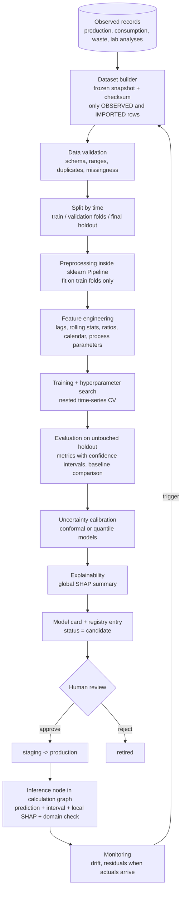

# Machine learning architecture

Package `engines/ml`. ML complements the deterministic chain. It fills gaps, forecasts, and flags anomalies. It does not produce environmental risk on its own authority.

## 1. Where ML is and is not used

| Task | Use ML? | Reason |
|------|---------|--------|
| Waste quantity prediction from production and process variables | Yes, when the facility has enough history | Captures non-linear effects the specific-factor method misses. Always shown beside the mass-balance or factor result |
| Waste composition prediction | Yes, limited | Only with lab-analysis history. Compositional targets (fractions summing to one) need suitable handling |
| Time-series forecasting of waste generation and material use | Yes | Planning storage and logistics |
| Anomaly detection in production, waste and transport records | Yes | Data quality and early warning. Unsupervised, so no labels are needed |
| Scenario classification | Only as a convenience label (clustering of scenarios by result profile) | Deterministic rule-based classification is preferred and is the default |
| Risk prediction | Not in initial scope as a target | No ground-truth risk labels exist. Training a model on the deterministic engine's own outputs would only produce a less transparent copy. A surrogate (emulator) may be added later purely to speed up Monte Carlo, validated against the engine, labelled as surrogate |
| LCA impacts, chemical properties, characterization factors, regulatory thresholds | No | Authoritative data or deterministic calculation exists. QSAR property estimates, if ever needed, come from recognized external tools through the provider layer and are tagged as estimates |

A model is only trained when the minimum data requirements in section 4 are met. Otherwise the UI states that there is not enough data and shows what would be needed.

## 2. Model families

Chosen by evidence in validation, starting simple:

1. Baselines: mean or last-period, specific-factor (Engine 2 tier 2), seasonal naive. Every model must beat the baseline on the holdout to be eligible for promotion.
2. Linear models (ridge, elastic net) with interpretable coefficients.
3. Random forest; gradient boosting (LightGBM or XGBoost) when non-linearity and interactions are supported by the data volume.
4. Time series: ETS, SARIMAX (statsmodels), and gradient boosting on lag features.
5. Anomaly detection: robust z-scores and seasonal-decomposition residuals first; Isolation Forest for multivariate cases.

Deep learning is not used. The datasets are tabular and small.

## 3. Pipeline

### Preprocessing and feature engineering

- All transformations live inside one `sklearn.pipeline.Pipeline` persisted with the model, so training and inference cannot diverge.
- Features come from a declared feature list with units and provenance. Rows tagged `PREDICTED`, `SCENARIO_ASSUMPTION` or `SYNTHETIC_DEMO` are excluded from training data by the dataset builder (demo models trained on synthetic data are permanently flagged as demo and cannot be promoted to production).
- Leakage controls: time-ordered splits only; lag and rolling features computed with strictly past data; no target-derived features; group-aware splits when several facilities are pooled (a facility is never in both train and test for a "new facility" claim).

### Validation

- Expanding-window time-series cross-validation; final holdout is the most recent period and is evaluated once.
- Metrics for regression: MAE, RMSE, MAPE or sMAPE where targets are far from zero, R2, bias, interval coverage. For anomaly detection, where labels exist: precision and recall at the alert threshold; where they do not: alert rate and reviewer-confirmed rate over time.
- Metrics are measured and stored in `ml_metrics`. Documentation, UI and reports show only stored metrics. No target accuracy is stated anywhere in advance.

### Prediction uncertainty

- Prediction intervals from split-conformal prediction or quantile regression, with empirical coverage reported on the holdout.
- The interval enters the scenario graph as the `Quantity` distribution of the predicted value.

### Applicability domain

- Each model version stores the training range per feature and a multivariate distance measure. At inference, inputs outside the domain yield `in_domain = false`; the prediction is shown with a warning and is not used by downstream nodes unless the user explicitly accepts it as a scenario assumption.
- This matters for scenarios: a substitution scenario often moves inputs outside what the plant has ever done. The system says so instead of extrapolating quietly.

## 4. Minimum data requirements (gates, configurable)

A training run is refused, with an explanation, unless: the target has a minimum number of independent observed periods (configured per task; set in Phase 9 from learning-curve evidence and recorded in `docs/assumptions.md`), the holdout covers at least one full seasonal cycle for seasonal models, and missingness is under a configured limit. The gate values are assumptions to be justified, not fixed constants in code.

## 5. Model registry and versioning

Every model version stores, in `ml_models`, `ml_training_datasets`, `ml_training_runs`, `ml_model_versions`, `ml_metrics`:

dataset snapshot and checksum, target, feature list, training period, validation methodology, metrics per split, hyperparameters, algorithm and library versions, random seed, code version, artefact checksum, semantic version, timestamps, status (`candidate`, `staging`, `production`, `retired`), applicability domain, approver.

- Artefacts are serialized with `skops` (preferred, avoids arbitrary code execution on load) or `joblib` with checksum verification, stored under `models/trained/<sha256>`.
- A model card (JSON plus rendered HTML) is generated per version: intended use, data, metrics, limitations, known failure modes.
- One production version per model. Promotion requires the `ml.promote` permission and is audit-logged. Rollback is a status change.

## 6. Inference

- In the calculation graph, an ML node's hash includes the model version id, so results are reproducible and recomputed on promotion.
- Output: `ml_predictions` row with features snapshot, prediction, interval, domain flag, and `model_explanations` row.
- Batch inference as a job; single predictions synchronously (models are small).

## 7. Explainable AI

- SHAP `TreeExplainer` for tree ensembles and `LinearExplainer` for linear models (exact, fast). Background data: a sample of the training set stored with the model version.
- Stored per prediction: base value, per-feature contribution, feature value.
- UI answers "why is this prediction higher?":
  - waterfall of contributions for one prediction;
  - global importance (mean absolute SHAP) and beeswarm;
  - direction of influence (dependence plots);
  - scenario comparison: for baseline and scenario predictions from the same model version, the difference in prediction decomposes into the difference of SHAP contributions per feature, shown as a paired bar chart.
- Mandatory wording next to every explanation: contributions describe how the model used the inputs to arrive at its prediction. They are not evidence that changing an input will cause the change in the real process.
- For deterministic results the same question is answered differently and more strongly: by exact contribution analysis and graph diff (see `docs/scenario-engine.md`), not SHAP. The UI keeps the two apart.

## 8. Monitoring and retraining

- Input drift: population stability index or Kolmogorov-Smirnov statistic per feature against the training distribution.
- Performance: residuals once actual values are recorded; rolling error compared with holdout error; interval coverage.
- Alert levels stored in `ml_monitoring_snapshots`. Retraining is triggered by alert or schedule, always produces a new candidate version, and never auto-promotes.

## 9. Tests

See `docs/testing.md`: preprocessing determinism, leakage tests, reproducibility with fixed seeds, artefact load and checksum, inference contract, SHAP additivity (contributions plus base value equal the prediction within tolerance).
