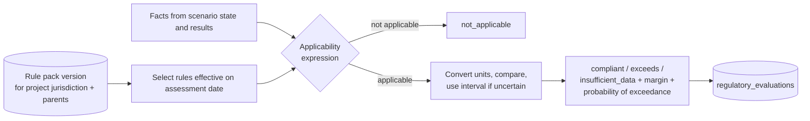

# Regulatory engine

Package `engines/regulatory`. Rules are data. Engine code contains a generic evaluator and no jurisdiction-specific logic.

## 1. Concepts

- **Jurisdiction**: hierarchical (`EU` -> `DE` -> federal state; `US` -> state; `GH`; `GB`). A project selects one jurisdiction profile and inherits parent rules unless a child rule supersedes them (`supersedes_rule_id`).
- **Regulation**: the legal or guidance instrument, with citation and URL.
- **Rule**: one testable requirement.
- **Rule pack**: a versioned, checksummed bundle of regulations and rules for a jurisdiction, imported as a dataset version. Packs are authored and reviewed by qualified people from the primary legal texts. This repository defines the format; it does not ship thresholds written from memory.

## 2. Rule structure

| Field | Description |
|-------|-------------|
| `jurisdiction` | Code |
| `regulation` | Reference to the instrument, article or annex |
| `category` | waste_classification, storage, transport, air_emission, water_discharge, soil_groundwater, reporting_obligation, permit_trigger |
| `code` | Stable rule identifier |
| `subject_code` | The result or input the rule tests (for example `air.emission_concentration`, `waste.storage_time`) |
| `comparator` | `<`, `<=`, `>`, `>=`, `in`, `not_in`, `exists` |
| `threshold_value`, `threshold_unit` | Limit; unit conversion handled by `core.units` |
| `averaging_basis` | For example daily mean, annual total, per consignment |
| `applicability` | Declarative condition (JSON expression) on facility sector, technology, capacity, waste code, hazard property, chemical, receptor type |
| `outcome_type` | limit (compliance), trigger (obligation applies), classification (assigns a class) |
| `source` | Citation with article, annex, page, and the `source_ref` |
| `effective_from`, `effective_to` | Validity |
| `version` | Rule version |
| `notes` | Interpretation notes by the pack author |

Applicability expressions use a small, safe expression grammar (JSON-encoded boolean logic over named facts: `all`, `any`, `not`, comparison operators, set membership). No arbitrary code runs from rule data.

Example shape (values are placeholders to show structure, not real limits):

```json
{
  "code": "EXAMPLE-AIR-001",
  "jurisdiction": "XX",
  "category": "air_emission",
  "subject_code": "air.emission_concentration",
  "applicability": { "all": [
    { "fact": "technology.code", "eq": "incineration" },
    { "fact": "chemical.cas", "eq": "<CAS>" }
  ]},
  "comparator": "<=",
  "threshold_value": null,
  "threshold_unit": "mg/m3",
  "averaging_basis": "daily_mean",
  "source": { "regulation": "<instrument>", "locator": "<annex / table>" },
  "effective_from": "<date>",
  "version": "1.0.0"
}
```

## 3. Evaluation



- With uncertain results the evaluation reports the outcome at the central estimate, the margin, and the probability of exceedance from Monte Carlo samples when available.
- Basis mismatch (for example the rule needs a daily mean and only an annual figure exists) yields `insufficient_data` with the reason. Values are never forced into the wrong basis.
- Evaluations are nodes in the calculation graph: the rule pack version is part of the hash, so a new pack version marks evaluations stale.
- The assessment date can be set per scenario, so future rules (already published, not yet in force) can be tested against planned changes.

## 4. Scope by jurisdiction profile (to be authored as packs)

| Profile | Instruments a pack author would typically cover (to be verified against current law at authoring time) |
|---------|----------------------------------------------------------------------------------------------------|
| European Union | Waste Framework Directive and List of Waste, CLP Regulation, Industrial Emissions Directive and BAT conclusions, Water Framework Directive and Environmental Quality Standards Directive, ADR for road transport, Waste Shipment Regulation, EIA Directive |
| Germany | KrWG, AVV, BImSchG and its ordinances, TA Luft, WHG, AwSV, NachwV |
| Ghana | Environmental Protection Agency Act and Environmental Assessment Regulations, Hazardous and Electronic Waste Control and Management Act, relevant Ghana Standards for effluent and air quality |
| United Kingdom | Environmental Permitting Regulations, hazardous waste regulations and WM3 technical guidance, COMAH |
| United States | RCRA, Clean Air Act, Clean Water Act, EPCRA; state programmes as child jurisdictions |
| International | Basel Convention, UN Model Regulations on dangerous goods, GHS |

Instrument names are listed to scope the pack work. Their content, thresholds and current status must be taken from the official texts when a pack is written.

## 5. Governance

- Each pack has an author, a reviewer, a review date and a statement of coverage (what is not covered).
- The UI shows pack version and review date next to every compliance statement, with the standing notice that the evaluation is decision support and does not constitute legal advice.
- Organizations may add internal rules (corporate standards, permit conditions) in an organization-scoped pack that layers over the jurisdiction pack.
