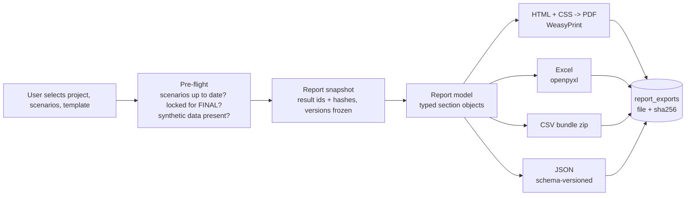

# Reporting architecture

Package `engines/reporting`. Reports are assembled from stored results only. Building a report never triggers a calculation; if a needed result is stale or missing, the build fails with a list of what to run.

## 1. Pipeline

The intermediate report model is the single source for all formats, so PDF, Excel, CSV and JSON cannot disagree.

## 2. Sections

| # | Section | Content source |
|---|---------|----------------|
| 1 | Executive summary | Key indicator deltas, top risks, completeness, main caveats. Text is templated from results; free-text commentary is authored by the user and marked as author commentary |
| 2 | Project description | `projects`, goal and scope |
| 3 | Facility | Facility data, location map |
| 4 | Production process | Steps, flow diagram generated from `process_steps` |
| 5 | Materials | Bill of materials, compositions, hazard classifications with sources |
| 6 | Waste | Streams, quantities, compositions, classification with triggering rules |
| 7 | Logistics | Chains, routes map, activity and exposure indicators |
| 8 | Environmental baseline | Receptors, layers used with dates |
| 9 | GIS vulnerability | Indicator profiles and maps |
| 10 | LCA | Goal and scope, inventory summary, impact results by stage, contributions, uncharacterized flows |
| 11 | Ecotoxicity | Risk quotients, not-assessed substances |
| 12 | Groundwater risk | Screening results with scope statement |
| 13 | Atmospheric risk | Emissions, dispersion tier and model, receptor results |
| 14 | Scenario analysis | Overrides with rationales, affected nodes |
| 15 | ML predictions | Model cards, predictions with intervals, domain flags, explanations with the non-causality notice |
| 16 | Uncertainty | Intervals, probability of improvement |
| 17 | Sensitivity | Tornado charts, indices, data worth improving |
| 18 | Mitigation | Measures as scenarios with their effect; user-authored measures marked as such |
| 19 | Scenario comparison | Performance matrix, dominance, optional ranking with weights |
| 20 | Conclusions | User-authored, with system-generated list of supporting results |
| 21 | Data sources | Dataset versions, licences, citations |
| 22 | Assumptions | Assumptions used with values |
| 23 | Model versions | Engine method versions, ML model versions, rule pack versions |
| 24 | Audit trail | Who ran what and when; trace appendix for selected key results |

Templates select and order sections (`report_templates.section_config`). Standard templates: full EIA support report, scenario comparison brief, LCA report, regulatory compliance summary, data and audit appendix.

## 3. Presentation rules

1. Every table of values has a provenance column and, where applicable, an uncertainty column. Charts mark predicted and scenario-assumption series with distinct line styles and a legend entry.
2. Screening-tier results carry the tier label and scope statement in the section, not only in an appendix.
3. Observed and predicted values are never in the same unlabelled series.
4. Any result with a synthetic-data taint adds a "DEMONSTRATION DATA" watermark on every page and blocks `final` status.
5. Significant figures are limited by uncertainty: values are rounded for display according to their interval; full precision remains in JSON and Excel exports.
6. Each key number has a short result reference (for example `R-3F2A`) that resolves to `GET /results/{id}/trace`, so a reader can ask for its lineage.
7. Gaps are printed. A "not assessed" list appears in each risk section and in the executive summary.

## 4. Formats

- **PDF**: paginated HTML rendered by WeasyPrint with CSS paged media (running headers, page numbers, table of contents, figure numbering). Maps are rendered server-side to static images from the same layers and styles as the web map; charts are rendered to SVG by the charting library in a headless render step or by matplotlib with a shared theme. PDF/A output and embedded document metadata (report id, snapshot hash).
- **Excel**: one workbook, one sheet per table, a README sheet, a data dictionary sheet (column, unit, provenance legend), frozen headers, numeric cells as numbers with units in adjacent columns.
- **CSV**: zip of tidy long-format tables plus `manifest.json`.
- **JSON**: the full report model with schema version, suitable for machine exchange and for regulators' tools.

## 5. Status and integrity

Statuses: `draft`, `in_review`, `final`. Moving to `final` requires locked scenarios, a reviewer with the `report.approve` permission and no blocking taints. Each export stores a SHA-256; the report shows its snapshot hash on the title page. A final report can be regenerated byte-comparable in content from its snapshot at any later time, because every referenced result is immutable.
