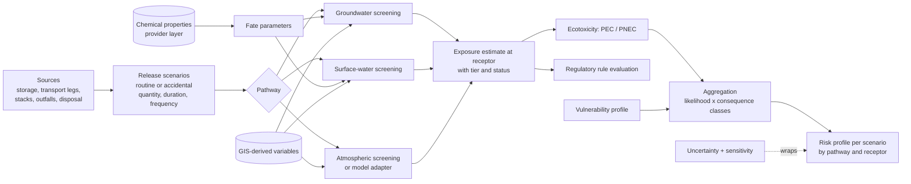

# Risk engine

Covers Engines 6 (groundwater), 7 (surface water), 8 (atmospheric), 9 (ecotoxicity), 12 (aggregation), 13 (uncertainty) and 14 (sensitivity).

Risk is assessed per source-pathway-receptor linkage. A linkage exists only if all three are present. Each assessment stores the source (storage unit, route segment, emission point, outfall, disposal site), the release scenario, the pathway, the receptor and the chemical.

## Environmental risk pipeline



## Release scenarios

Routine releases (permitted emissions, effluent) come from Engines 1 and 2. Accidental releases are defined as release scenarios: source, released quantity, release duration and annual frequency.

- Storage: quantity from storage inventory and containment configuration. Containment effectiveness and failure frequencies are imported reference values or user-provided with source. If none exist, the scenario is evaluated conditionally ("given a release of X") and the frequency is reported as unknown, not assumed.
- Transport: frequency from the logistics engine (`docs/logistics.md`).

## Groundwater

Node ids: `risk.groundwater.vulnerability`, `risk.groundwater.travel_time`, `risk.groundwater.attenuation`, `risk.groundwater.classify`.

**Scope statement.** This is a screening model. It ranks linkages and identifies those needing hydrogeological investigation. It does not predict plume geometry, concentrations at arbitrary points in space and time, or behaviour in fractured or karst aquifers. The UI and reports print this statement with every groundwater result.

**Inputs**

| Input | Unit | Source |
|-------|------|--------|
| Released mass, duration | kg, d | Release scenario |
| Containment present and effectiveness | fraction | Storage data, provenance required |
| Chemical: Koc, solubility, half-life (soil, groundwater), density | various | Provider layer |
| Soil: texture class, f_oc, bulk density, water content | various | Soil dataset or site data |
| Net recharge or infiltration q | m/yr | Climate and soil datasets, or imported recharge layer |
| Depth to groundwater L | m | Site data or imported layer |
| Hydraulic conductivity K, gradient i, effective porosity n_e | m/d, -, - | Site data; literature ranges per aquifer type only as registered assumptions with wide ranges |
| Intrinsic vulnerability class or components | class | Imported map or scheme (Engine 11) |
| Distance to receptor x, direction relative to gradient | m | GIS |
| Land cover / surface sealing | class | GIS |

**Calculations** (standard screening relations)

1. Intrinsic vulnerability: imported class, or scheme index from Engine 11.
2. Unsaturated-zone travel time (piston flow): `t_u = L * theta * R / q`.
3. Saturated-zone seepage velocity (Darcy): `v = K * i / n_e`; contaminant travel time to a receptor at distance x along the flow path: `t_s = x * R / v`.
4. Attenuation by first-order decay over travel time: `f_decay = exp(-k * (t_u + t_s))`.
5. Optional dilution-attenuation factor in the mixing zone, following the form used in US EPA Soil Screening Guidance: `DAF = 1 + (K * i * d) / (I * L_s)`, with d mixing-zone depth, I infiltration rate and L_s source length parallel to flow.
6. Solubility check: leachate concentration cannot exceed water solubility.

R and k come from the fate engine. If the hydraulic gradient direction is unknown, receptors in all directions within the search radius are treated as potentially down-gradient and the result is flagged.

**Outputs.** Vulnerability class; travel-time range to each receptor [yr]; attenuation factor range; screening concentration indicator at the receptor only if steps 2 to 5 all have site data, otherwise omitted; classification (likelihood class of reaching the receptor within the assessment horizon); list of data gaps ranked by sensitivity.

**Assumptions.** Homogeneous, isotropic porous medium; steady uniform flow; linear equilibrium sorption; no dispersion (which makes arrival time estimates sharp where reality is spread out); no free-phase product.

**Uncertainty.** K commonly varies over orders of magnitude; inputs are entered as ranges or lognormal distributions and results are always intervals.

**Validation.** Hand-computed reference cases; reproduction of the published DAF worked example; comparison with an external analytical tool on shared test cases in Phase 7.

**Limitations.** Not valid for karst, fractured rock, dense or light non-aqueous phase liquids, strongly ionizing substances without measured Kd, or pumping-influenced flow fields. In those conditions the node returns `out_of_validity_range` and recommends refined modelling. Refined groundwater models can be attached through the `GroundwaterModelAdapter` interface.

## Surface water

Node ids: `risk.surface_water.pathway`, `risk.surface_water.pec`, `risk.surface_water.classify`.

**Inputs.** Release (routine effluent load or spill mass); outfall or spill location; DEM-derived flow path and distance to nearest water body, slope, drainage or sewer connection (if known); land cover; receiving water flow statistics (mean and low flow) from gauging data or imported hydrological datasets; background concentration if known; imported PNEC or environmental quality standard.

**Calculations**

1. Pathway indicators from GIS: flow-path length to water, slope, intervening land cover, presence of containment or interceptors. These give a connectivity class. No overland transport simulation is performed.
2. Routine discharge, fully mixed concentration by mass balance: `C = (Q_e * C_e + Q_u * C_u) / (Q_e + Q_u)`, evaluated at mean and low river flow.
3. Spill, conservative first tier: released mass reaching the water body (after containment fraction) mixed into the flow volume passing during the release duration. Reported as an upper-bound indicator.
4. Risk quotient: `RQ = PEC / PNEC` (see Ecotoxicity).

**Outputs.** Connectivity class, PEC at mean and low flow [mg/L or ug/L], RQ, exceedance of imported quality standards, status.

**Assumptions.** Complete mixing; no in-stream degradation, sorption or volatilization in the first tier (conservative); steady flow.

**Limitations.** Lakes, estuaries, tidal waters and mixing-zone geometry need refined models. Where river flow data is missing the node returns pathway indicators only.

## Atmospheric

Node ids: `risk.air.emissions`, `risk.air.screening_dispersion`, `risk.air.receptor_exposure`.

**Structure.** Three separate steps, so that emission estimation remains usable when no dispersion model is available.

1. **Emission estimation.** `E_i = A * EF_i * (1 - eta_i)` where A is activity (mass of waste treated), EF an emission factor for the pollutant and technology from an imported source (for example the EMEP/EEA emission inventory guidebook, US EPA AP-42, or permit-specific measured values), and eta the abatement efficiency of the control device, with source. For substances conserved through combustion (for example metals, chlorine as HCl precursors) a mass-balance bound from waste composition (Engine 3) is calculated alongside, and the two are shown side by side.
2. **Dispersion.** Through the `DispersionModel` interface:

```python
class DispersionModel(Protocol):
    code: str; version: str; tier: Literal["screening", "regulatory"]
    def validate_inputs(self, case: DispersionCase) -> list[DataGap]: ...
    def run(self, case: DispersionCase) -> DispersionResult: ...   # concentration fields + receptor values
```

   - Built-in `gaussian_screening`: the steady-state Gaussian plume equation for a continuous point source,
     `C(x,y,z) = Q / (2 pi u sigma_y sigma_z) * exp(-y^2 / (2 sigma_y^2)) * [exp(-(z-H)^2 / (2 sigma_z^2)) + exp(-(z+H)^2 / (2 sigma_z^2))]`,
     with dispersion coefficients from a published stability-class scheme loaded as method data, evaluated over a matrix of wind speeds and stability classes to give a worst-case ground-level concentration by distance. Tier: screening.
   - Adapters (later phases) for validated regulatory models, run as native executables with file exchange: for example AERMOD or AERSCREEN (US EPA), AUSTAL (Germany). The adapter records model version, input files and checksums.
3. **Receptor exposure.** Receptor concentrations from the dispersion result. Without any dispersion run, the subsystem reports only: emission rates, receptors by distance and bearing, and frequency of wind towards each receptor from the wind rose. That output is labelled "proximity and wind-direction indicators", and is never called a concentration or a dispersion result.

**Inputs for dispersion.** Emission rate; stack height, diameter, exit velocity, exit temperature; building dimensions (for downwash, refined models only); meteorology (hourly series for regulatory models; wind rose and stability frequencies for screening); terrain; receptor grid and discrete receptors.

**Assumptions (screening).** Flat terrain, steady meteorology, no chemistry, no deposition, no building downwash. Not valid in calm winds, complex terrain or very near the source.

**Validation.** Screening implementation checked against hand calculations and a published worked example; adapters checked against the model's own test cases.

## Ecotoxicity

Node ids: `risk.ecotox.rq`, `risk.ecotox.mixture`.

- `RQ_(i,c) = PEC_(i,c) / PNEC_(i,c)` for substance i in compartment c. PNEC values are imported (for example from ECHA registration data or national quality standards) with their assessment factors and sources. Weta does not derive PNECs from raw toxicity data in the initial scope.
- First-tier mixture assessment by concentration addition: `RQ_mix = sum_i RQ_i`, reported together with the per-substance contributions and labelled as a conservative first tier.
- Substances without a PNEC are listed as "not assessed". They are never treated as zero.
- LCA ecotoxicity (comparative, potential impact per functional unit) is a different quantity from site-specific RQ. The two are presented in separate sections and never added.

## Aggregation

Node ids: `risk.aggregate.linkage`, `risk.aggregate.scenario_profile`.

1. Each linkage gets a likelihood class and a consequence class from the versioned `risk_matrices` definition. Class boundaries are configuration with a recorded rationale.
   - Likelihood: from release frequency (if known) combined with pathway connectivity or travel-time class.
   - Consequence: from RQ or exceedance class combined with receptor sensitivity class.
2. Linkage risk class = matrix lookup. The limiting factor (which input drove the class) is stored.
3. Scenario risk profile = table of pathway by receptor type with the highest class and the count of linkages per class. This is the default presentation.
4. An overall scenario indicator is available only through the decision-support module (`docs/scenario-engine.md`), where weights and normalization are explicit and user-controlled.

Rule: an assessment with status `insufficient_data` is shown as "not assessed" and counts against a completeness metric that accompanies every profile. Missing data must never make a scenario look safer.

## Uncertainty

Engine 13, package `engines/uncertainty`.

- Inputs carry `uncertainty_specs`. Sources of specs, in order of preference: measured dispersion, dataset-provided uncertainty (for example LCI lognormal parameters), pedigree-based estimation where a recognized scheme is imported, expert range entered by the user with rationale. A point value with no spec is displayed as "uncertainty not characterized", not as exact.
- Propagation: Monte Carlo over the affected subgraph with Latin hypercube sampling (scipy `qmc`), explicit seed, common random numbers across scenarios so that scenario differences are not drowned by sampling noise. Correlated inputs via rank correlation where the user defines it.
- Convergence: the run continues in batches until the standard error of the chosen percentiles is under a configured tolerance or the sample cap is reached; the achieved value is stored.
- Outputs: mean, standard deviation, P5, P25, P50, P75, P95, probability that scenario A is better than baseline per indicator (paired samples), probability of exceeding a threshold.
- Class-valued results (risk classes) report the probability of each class.
- Model-structure uncertainty is not quantified numerically. It is documented per engine under limitations and shown next to results.
- ML prediction uncertainty enters as the model's prediction interval distribution (`docs/ml.md`).

## Sensitivity

Engine 14.

| Method | Use | Output |
|--------|-----|--------|
| One-at-a-time (plus or minus a set percentage or between P5 and P95) | Default, cheap, tornado chart | Change in output, elasticity |
| Morris elementary effects (SALib) | Screening many inputs | mu*, sigma |
| Sobol variance-based (SALib) | Final ranking, interactions | First-order S1 and total ST with confidence intervals |

Sensitivity results drive the data-gap list: inputs with high total sensitivity and weak provenance (`USER_PROVIDED`, default assumptions, wide ranges) are ranked first as "data worth improving".
