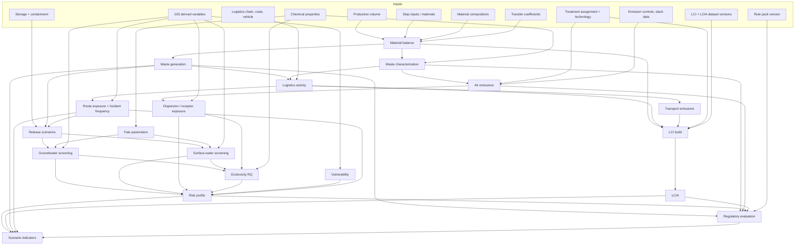
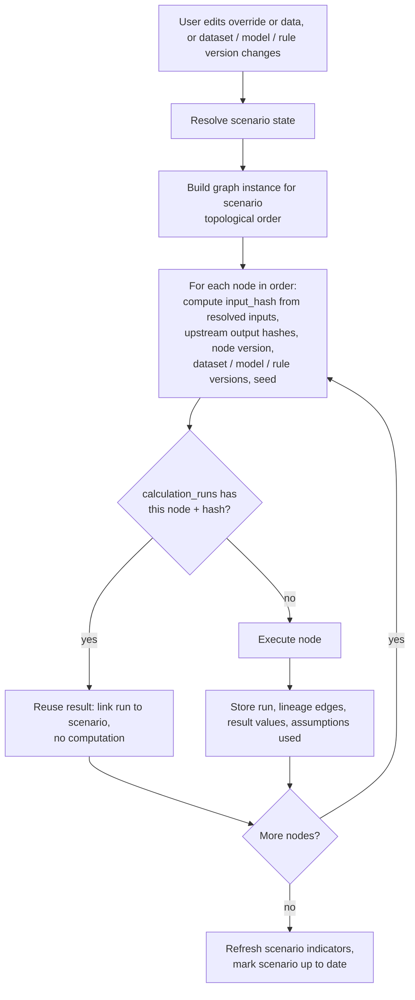

# Scenario engine

Package `engines/scenarios`. This is the central engine: it resolves a scenario's state, runs the calculation graph incrementally, compares scenarios and supports multi-objective decisions.

## 1. Scenario model

- A **baseline** scenario references the project's current facts. It has no overrides.
- An **alternative** scenario has a parent (baseline or another alternative) and a list of `scenario_inputs`: typed overrides.
- A **combined** scenario lists component scenarios in order; its overrides are the ordered union of theirs. Conflicts (two components setting the same target field) are detected at creation and must be resolved by the user.
- Duplicating a scenario copies its override rows, not the project data. Baseline data is never copied or mutated.

Override operations:

| op | Meaning | Example |
|----|---------|---------|
| `set` | Replace a quantity | Production volume = 12 000 t/yr |
| `scale` | Multiply | Solvent use x 0.8 |
| `add` | Add | Storage capacity + 20 m3 |
| `replace_ref` | Swap a referenced entity | Step input material: Solvent A -> Solvent B |
| `insert` | Add an entity | New emission control device on stack 2 |
| `remove` | Remove an entity | Drop transfer station |

Changeable targets: production volume; raw materials and chemicals (identity, quantity, composition); process parameters and transfer coefficients; treatment technology and facility; transport mode, vehicle, route, frequency; disposal route; containment; emission controls.

Every override requires a rationale and is stored as `SCENARIO_ASSUMPTION`. A `replace_ref` on a material triggers a guided checklist: quantities per functional unit, composition, transfer coefficients, and treatment compatibility for the new material must each be confirmed, supplied, or explicitly inherited (inherited values are flagged as assumptions).

## 2. State resolution

```
resolved_state(scenario) = apply(overrides(scenario), resolved_state(parent))
resolved_state(baseline) = project facts as of the baseline reference date
```

The resolver produces an immutable in-memory `ScenarioState` (typed objects, all quantities with provenance). Engines only ever see resolved state; they do not know scenarios exist.

## 3. Calculation graph

Nodes are engine functions instantiated per subject (for example `waste.generation` for waste stream W1). Edges are data dependencies declared by the node's input model.



## 4. Dependency tracking and incremental recalculation

Processing flow:



Properties:

- Content addressing does the dependency tracking. Changing the transport route changes the hashes of `logistics.activity` and everything downstream of it, while material balance and waste characterization hashes are unchanged and are reused, including across scenarios. A scenario that differs from baseline only in route recalculates only the logistics, route-exposure, release, risk, LCA-transport and indicator nodes.
- Early cut-off: if a node re-executes but its output hash is unchanged, its dependants are not re-executed.
- Staleness preview: on edit, the API computes the affected node set by graph reachability from the changed inputs without running anything, so the UI can show "this change affects: logistics, groundwater risk (route segments), LCA transport stage" before the user presses run.
- Partial failure: a node with `insufficient_data` does not stop the graph. Dependants that need its output are marked `blocked` with the reason; independent branches complete.
- Execution: small graphs run in a process pool for interactive response; Monte Carlo and large graphs run as jobs. Node granularity is per subject, so independent subjects run in parallel.
- Determinism: all randomness is seeded from the scenario analysis seed; rerunning with identical inputs reproduces identical outputs. A nightly reproducibility check re-executes a sample of stored runs and compares.

## 5. Scenario comparison

For each indicator and subject, with baseline value b and scenario value s:

- absolute change `s - b` (same unit);
- percentage change `(s - b) / |b| * 100`, reported as "not defined" when b is zero and as "new" or "eliminated" where a stream appears or disappears;
- interval on the change from paired Monte Carlo samples (common random numbers), and the probability that the scenario is better than baseline;
- class changes for categorical results (for example hazard property gained or lost, risk class moved from medium to high);
- comparability checks: same functional unit and boundary for LCA, same method versions, same dataset versions. If versions differ, the baseline is recomputed under the scenario's versions or the comparison is refused with an explanation.

"Why did it change" for deterministic results: graph diff. The comparison service lists the overrides, the nodes whose outputs changed, and for each changed indicator the upstream path of changed values (for example: solvent replaced -> waste composition: halogenated fraction 0 -> x -> hazard property added -> incineration required -> transport distance to capable facility + y km -> ...). This is exact attribution along the calculation path, and is the primary explanation mechanism. SHAP is used only for ML nodes on that path.

Spatial comparison is described in `docs/gis.md`.

## 6. Multi-objective decision support

Node ids: `decision.matrix`, `decision.rank`.

Objectives (configurable, each mapped to one or more indicators with a direction): environmental risk (profile-derived indicators per pathway), waste generation (total and hazardous), carbon impact (LCIA climate change), water impact (LCIA water use, effluent load), logistics risk (exposure index, release frequency), cost (user-provided cost model: materials, treatment gate fees, transport; all `USER_PROVIDED`), regulatory risk (count and severity of exceedances, margin to thresholds).

Presentation order, which is also the order of trust:

1. **Performance matrix**: scenarios by objectives in natural units with uncertainty intervals and completeness per cell. Always shown first.
2. **Dominance analysis**: Pareto-efficient scenarios are identified without any weights. A dominated scenario is flagged with the scenario that dominates it.
3. **Optional weighted ranking**: the user chooses a method and enters weights.
   - Weighted sum on normalized values (min-max across the scenario set or relative to baseline; the choice is displayed);
   - TOPSIS as an alternative;
   - constraint mode: objectives can be set as constraints (for example "no regulatory exceedance", "no linkage in the highest risk class") that exclude scenarios before ranking.
4. **Robustness**: weight sensitivity (how far a weight must move before the top rank changes) and rank probability under Monte Carlo (share of samples in which each scenario ranks first).

Rules: a ranking is always displayed with its weights, normalization and the matrix it came from; the stored `decision_analyses` record contains all of them; cells with insufficient data are shown as gaps and, by default, a scenario with a gap in a constrained objective cannot be ranked first.

## 7. Locking and versions

A scenario can be locked for reporting. Locking pins dataset, method, model and rule-pack versions and freezes overrides. Later data updates create a new scenario revision; locked results remain reproducible and are what issued reports cite.
